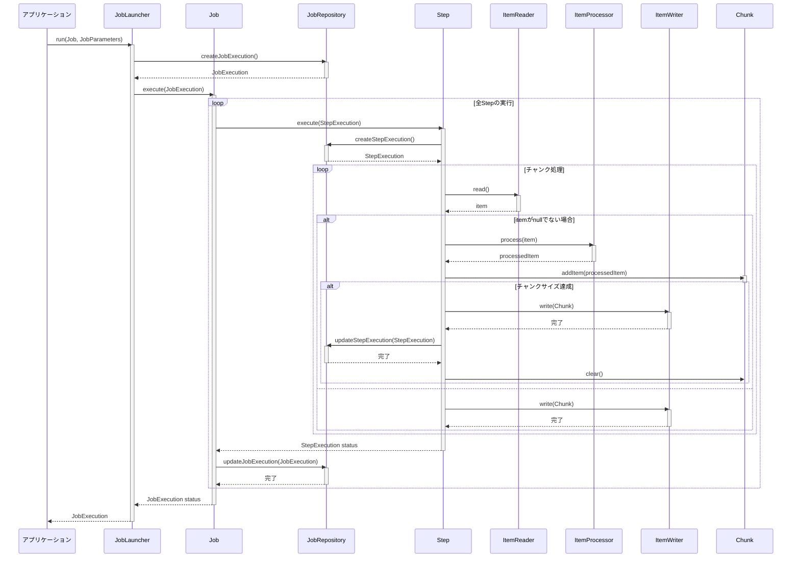

Spring Batchの主要コンポーネント間の相互作用を示すシーケンス図を作成します。

シーケンスの説明

1. ジョブ起動: アプリケーションがJobLauncherを通じてジョブを実行
2. 実行記録の作成: JobRepositoryにJobExecutionとStepExecutionを作成
3. ステップ実行: ジョブ内の各ステップを順次実行
4. チャンク処理:
   · ItemReaderでデータ読み取り
   · ItemProcessorでデータ加工（オプション）
   · チャンクにアイテムを追加
   · チャンクサイズ達成時にItemWriterで書き込み
5. 状態更新: 各処理後にJobRepositoryに実行状態を保存
6. 完了処理: 全ステップ終了後、最終結果を返す

主要コンポーネントの役割

· JobLauncher: ジョブ実行のエントリーポイント
· JobRepository: メタデータ（実行状態など）の永続化
· Job: バッチ処理の実行単位
· Step: ジョブを構成する個々の処理単位
· ItemReader: データ入力
· ItemProcessor: データ加工
· ItemWriter: データ出力
· Chunk: トランザクション処理の単位

このシーケンス図はSpring Batchの基本的な処理フローを示しており、実際の実装ではより複雑な処理やリスナーなどが追加される場合があります。