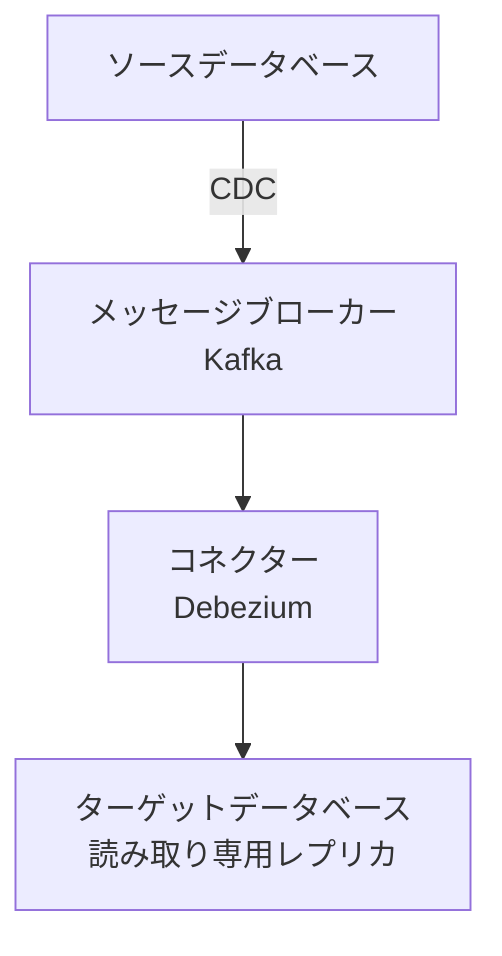

# マイクロサービスデータベース構成設計書

## 1. 概要

### 1.1. 目的
本設計書は、マイクロサービスアーキテクチャにおけるデータベースの構成方針、設計原則、および実装方式を定義することを目的とする。

### 1.2. 適用範囲
- 全マイクロサービスおよび関連データベース
- データ永続化層の設計と実装
- データ連携および整合性保証メカニズム

## 2. 設計原則

### 2.1. 基本方針
- **データベース・パー・サービス**: 各マイクロサービスが独自のデータベースを保有
- **サービス自律性**: サービス間の直接的なデータベース共有を禁止
- **API駆動連携**: サービス間データ連携はAPI経由でのみ実施
- **適切なデータベース技術の選択**: 用途に応じた最適なデータベース技術の採用

## 3. データベース構成

### 3.1. データベースタイプ別構成

| サービス名 | データベースタイプ | バージョン | 用途 | データ規模見積り |
|------------|-------------------|------------|------|------------------|
| ユーザーサービス | PostgreSQL | 14.x | トランザクションデータ | 10GB/年 |
| 注文サービス | PostgreSQL | 14.x | トランザクションデータ | 50GB/年 |
| 商品カタログサービス | MongoDB | 5.x | ドキュメントデータ | 5GB/年 |
| 分析サービス | Amazon Redshift | - | 分析データ | 1TB/年 |
| キャッシュサービス | Redis | 6.x | セッション/キャッシュ | メモリ内 |
| 検索サービス | Elasticsearch | 7.x | 全文検索 | 20GB/年 |

### 3.2. 接続設定

```yaml
# データベース接続設定例
database:
  host: ${DB_HOST}
  port: ${DB_PORT}
  name: ${DB_NAME}
  username: ${DB_USER}
  password: ${DB_PASSWORD}
  pool:
    max: 20
    min: 5
    acquire: 30000
    idle: 10000
  dialect: postgres
  ssl: require
```

## 4. データモデル設計

### 4.1. サービス別データモデル

**ユーザーサービス（PostgreSQL）**
```sql
CREATE TABLE users (
    id UUID PRIMARY KEY DEFAULT gen_random_uuid(),
    email VARCHAR(255) UNIQUE NOT NULL,
    password_hash VARCHAR(255) NOT NULL,
    first_name VARCHAR(100),
    last_name VARCHAR(100),
    created_at TIMESTAMP WITH TIME ZONE DEFAULT CURRENT_TIMESTAMP,
    updated_at TIMESTAMP WITH TIME ZONE DEFAULT CURRENT_TIMESTAMP,
    is_active BOOLEAN DEFAULT true
);

CREATE TABLE user_profiles (
    user_id UUID PRIMARY KEY REFERENCES users(id),
    avatar_url VARCHAR(500),
    preferences JSONB,
    last_login TIMESTAMP WITH TIME ZONE
);
```

**注文サービス（PostgreSQL）**
```sql
CREATE TABLE orders (
    id UUID PRIMARY KEY DEFAULT gen_random_uuid(),
    user_id UUID NOT NULL, -- 参照のみ、外部キー制約は設定しない
    total_amount DECIMAL(10,2) NOT NULL,
    status VARCHAR(50) NOT NULL,
    created_at TIMESTAMP WITH TIME ZONE DEFAULT CURRENT_TIMESTAMP
);

CREATE TABLE order_items (
    id UUID PRIMARY KEY DEFAULT gen_random_uuid(),
    order_id UUID REFERENCES orders(id),
    product_id UUID NOT NULL, -- 商品サービス参照
    quantity INTEGER NOT NULL,
    unit_price DECIMAL(10,2) NOT NULL
);
```

## 5. データ整合性戦略

### 5.1. 分散トランザクション管理
- **Sagaパターンの採用**: 長時間トランザクションを一連のローカルトランザクションに分解
- **補償トランザクション**: 失敗時のロールバック処理を実装

### 5.2. イベント駆動アーキテクチャ
- **変更データキャプチャ（CDC）**: データベース変更のイベント発行
- **イベントソーシング**: 重要な状態変化のイベント記録

## 6. データレプリケーションと同期

### 6.1. クロスサービスデータ参照
- **API呼び出し**: リアルタイムデータ参照
- **データレプリカ**: 読み取り専用データの非同期複製
- **マテリアライズドビュー**: 集計データの事前計算

### 6.2. データ同期方式


## 7. バックアップとリカバリ

### 7.1. バックアップ戦略
- **自動スナップショット**: 日次スナップショット（7日間保持）
- **トランザクションログ**: 15分間隔の継続的アーカイブ
- **地理的冗長化**: 別リージョンへの複製

### 7.2. リカバリ目標
- **RPO（目標復旧時点）**: 最大15分
- **RTO（目標復旧時間）**: 2時間以内

## 8. セキュリティ対策

### 8.1. データ保護
- **暗号化**: 転送中（TLS 1.3）および保存中（AES-256）の暗号化
- **マスキング**: 非生産環境での個人情報マスキング
- **アクセス制御**: ロールベースアクセス制御（RBAC）

### 8.2. 監査と監視
- **監査ログ**: 全てのデータアクセス操作の記録
- **異常検知**: 不審なアクセスパターンの検出
- **コンプライアンス**: GDPR、PCI DSS対応

## 9. 監視とパフォーマンス

### 9.1. 監視指標
- データベース接続数
- クエリ応答時間
- トランザクション率
- レプリケーションラグ

### 9.2. パフォーマンス最適化
- インデックス設計
- クエリ最適化
- 接続プーリング
- 読み取りレプリカの活用

## 10. デプロイメントとマイグレーション

### 10.1. データベース変更管理
- **バージョン管理**: 全てのスキーマ変更のバージョン管理
- **移行スクリプト**: 自動化されたデータベース移行（Flyway/Liquibase）
- **ブルーグリーンデプロイ**: ダウンタイムゼロでのスキーマ変更

### 10.2. 環境構成
| 環境 | インスタンスサイズ | レプリカ数 | バックアップ保持期間 |
|------|-------------------|------------|---------------------|
| 開発 | t3.medium | 1 | 3日 |
| ステージング | r5.large | 2 | 7日 |
| 本番 | r5.4xlarge | 3+ | 35日 |

## 11. 今後の拡張性

### 11.1. スケーリング戦略
- **水平スケーリング**: シャーディングによるデータ分散
- **読み取りスケーリング**: レプリカの追加
- **機能別分割**: データベースの機能別分離

### 11.2. 技術的負債管理
- 定期的なパフォーマンスレビュー
- 未使用インデックスの削除
- データアーカイブ戦略の実施

---
**承認者**:
- システムアーキテクト: ____________________
- データベース管理者: ____________________
- セキュリティ責任者: ____________________

**最終更新日**: 2024年3月15日

**バージョン**: 1.0

---

# マイクロサービスにおけるPostgreSQLの最適な設計

マイクロサービスアーキテクチャでは、データベース設計が非常に重要です。以下に最適なインスタンス、データベース設計を提案します。

## 設計原則

### 1. **サービスごとに独立したデータベース**
```sql
-- サービスごとに専用データベースを作成
CREATE DATABASE user_service_db;
CREATE DATABASE order_service_db;
CREATE DATABASE product_service_db;
```

### 2. **データベース・パー・サービスパターン**
各マイクロサービスが独自のデータベースを持ち、他のサービスから直接アクセスできないようにする。

## 推奨アーキテクチャ

### オプション1: 単一インスタンス・マルチデータベース（コスト効率型）
```
PostgreSQLインスタンス (ポート5432)
├── user_service_db（ユーザーサービス）
├── order_service_db（注文サービス）
├── product_service_db（商品サービス）
└── payment_service_db（決済サービス）
```

**メリット**:
- リソース効率が良い
- 管理コストが低い
- バックアップ/リストアが一括で可能

**デメリット**:
- 単一障害点のリスク
- リソース競合の可能性

### オプション2: サービスグループごとのインスタンス（バランス型）
```
インスタンス1 (ポート5432) - コアサービス
├── user_service_db
├── auth_service_db

インスタンス2 (ポート5433) - トランザクションサービス  
├── order_service_db
├── payment_service_db

インスタンス3 (ポート5434) - 参照サービス
├── product_service_db
├── catalog_service_db
```

### オプション3: サービスごとの専用インスタンス（高可用性型）
```
ユーザーサービスインスタンス (ポート5432)
└── user_service_db

注文サービスインスタンス (ポート5433)
└── order_service_db

商品サービスインスタンス (ポート5434)  
└── product_service_db
```

## 詳細設計例

### 1. 接続設定と権限管理
```sql
-- サービスごとの専用ユーザー作成
CREATE ROLE user_service LOGIN PASSWORD 'secure_password';
CREATE ROLE order_service LOGIN PASSWORD 'secure_password';

-- データベースごとの権限制御
GRANT CONNECT ON DATABASE user_service_db TO user_service;
GRANT ALL PRIVILEGES ON ALL TABLES IN SCHEMA public TO user_service;

-- 他のサービスからのアクセス禁止
REVOKE CONNECT ON DATABASE user_service_db FROM PUBLIC;
```

### 2. スキーマ設計
```sql
-- サービス内で論理的分離が必要な場合にスキーマを使用
CREATE SCHEMA user_management;
CREATE SCHEMA user_audit;

-- サービスごとの検索パス設定
ALTER ROLE user_service SET search_path TO user_management, user_audit, public;
```

### 3. リソース管理（インスタンスレベル）
```ini
# postgresql.confの設定例
# インスタンス1（コアサービス）
max_connections = 200
shared_buffers = 4GB
work_mem = 16MB

# インスタンス2（トランザクションサービス）
max_connections = 300
shared_buffers = 6GB
work_mem = 8MB
```

## データ整合性パターン

### 1. サーガパターン（分散トランザクション）
```python
# サーガオーケストレーターの例
def create_order_saga(user_id, order_data):
    try:
        # 1. 在庫確保
        inventory_service.reserve_stock(order_data.items)
        
        # 2. 注文作成
        order = order_service.create_order(user_id, order_data)
        
        # 3. 決済処理
        payment_service.process_payment(user_id, order.amount)
        
        # 4. 在庫確定
        inventory_service.confirm_stock(order_data.items)
        
    except Exception as e:
        # 補償トランザクション
        inventory_service.release_stock(order_data.items)
        order_service.cancel_order(order.id)
        raise e
```

### 2. API合成パターン
```python
def get_user_dashboard(user_id):
    # 各サービスからデータを取得
    user_data = user_service.get_user(user_id)
    orders = order_service.get_user_orders(user_id)
    payments = payment_service.get_user_payments(user_id)
    
    # APIレベルでデータを合成
    return {
        'user': user_data,
        'orders': orders,
        'payments': payments
    }
```

## 監視と運用設計

### 1. サービスごとの監視
```yaml
# Prometheus設定例
- job_name: 'user_service_db'
  static_configs:
    - targets: ['localhost:5432']
      
- job_name: 'order_service_db'  
  static_configs:
    - targets: ['localhost:5433']
```

### 2. バックアップ戦略
```bash
# サービスごとのバックアップスクリプト
#!/bin/bash
SERVICES=("user_service" "order_service" "product_service")

for SERVICE in "${SERVICES[@]}"; do
    pg_dump -h localhost -p 5432 ${SERVICE}_db > /backups/${SERVICE}_$(date +%Y%m%d).sql
done
```

## 推奨構成表

| サービス特性 | 推奨構成 | 理由 |
|-------------|----------|------|
| 高トラフィック核心サービス | 専用インスタンス | パフォーマンス分離、障害分離 |
| 中程度トラフィックサービス | グループ化インスタンス | コストと性能のバランス |
| 低トラフィック/開発環境 | 単一インスタンス・マルチDB | コスト効率、管理容易性 |
| 厳格なコンプライアンス要件 | 完全分離インスタンス | データ分離、監査容易性 |

## セキュリティ設計

```sql
-- ネットワーク分離
-- 各サービスは自分のデータベースにのみ接続可能

-- 通信暗号化
ssl = on
ssl_cert_file = '/etc/ssl/certs/ssl-cert-snakeoil.pem'
ssl_key_file = '/etc/ssl/private/ssl-cert-snakeoil.key'

-- 接続制限
# pg_hba.conf
host user_service_db user_service 10.0.1.0/24 md5
host order_service_db order_service 10.0.2.0/24 md5
```

## マイグレーション戦略

```bash
# サービスごとの独立したマイグレーション
# user-service/migrations/
# ├── 001_create_users_table.sql
# ├── 002_add_email_index.sql

# order-service/migrations/  
# ├── 001_create_orders_table.sql
# ├── 002_add_status_index.sql
```

この設計により、各マイクロサービスはデータの独立性を保ちながら、適切なリソース配分と障害分離を実現できます。サービス規模や可用性要件に応じて、適切な構成を選択してください。
