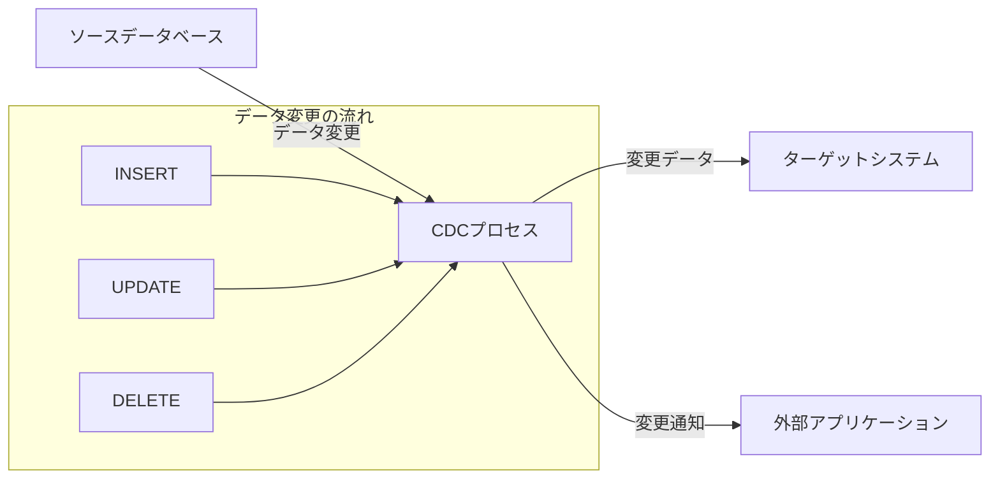
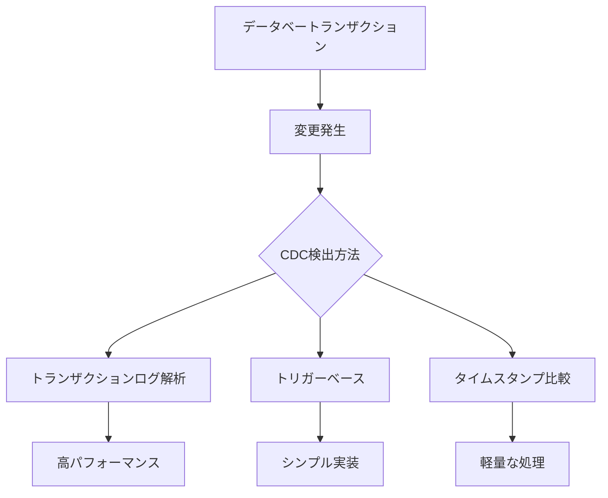
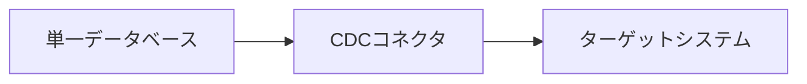
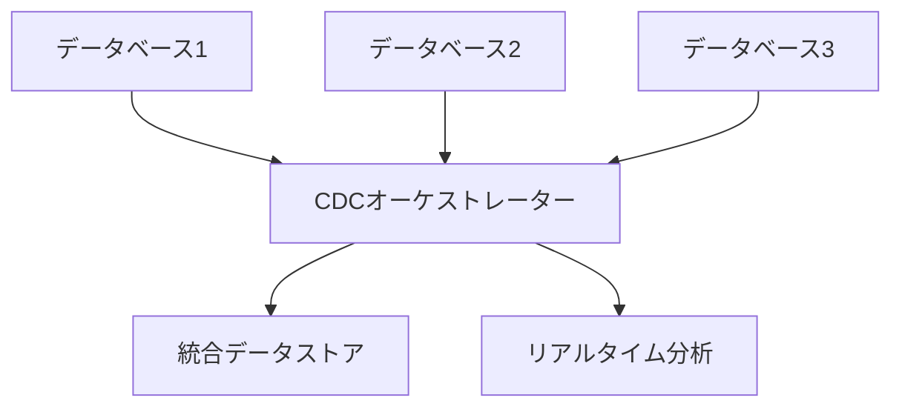
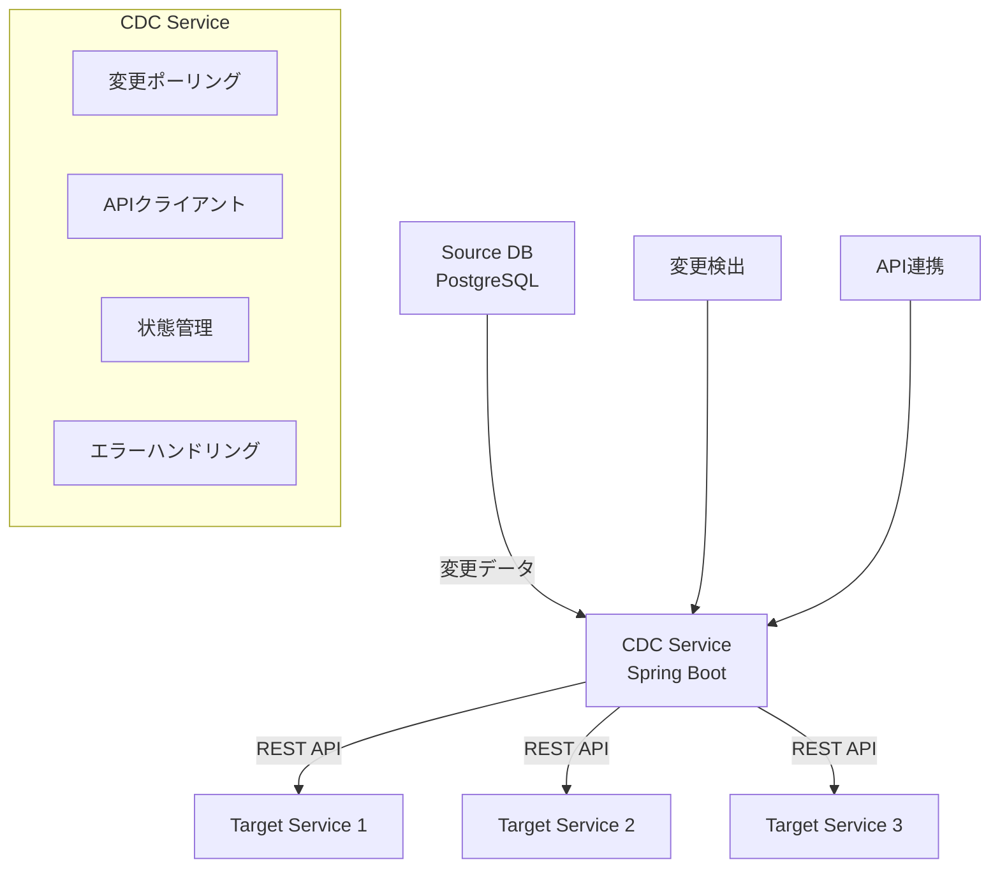

# CDC（Change Data Capture）の詳細解説

## 1. CDCとは何か？

### 1.1. 基本定義
**CDC（Change Data Capture）** とは、データベース内で発生したデータ変更（INSERT、UPDATE、DELETE）を検出し、その変更内容を他のシステムやアプリケーションに通知する技術です。

### 1.2. 核心的な概念


## 2. CDCの主要な目的と価値

### 2.1. 主な目的
- **リアルタイムデータ同期**: 複数システム間のデータ一貫性維持
- **イベント駆動アーキテクチャ**: データ変更をイベントとして伝播
- **データパイプライン**: データウェアハウスや分析システムへのデータ供給
- **監査と追跡**: データ変更の履歴管理

### 2.2. ビジネス価値
| 価値 | 説明 |
|------|------|
| **リアルタイム性** | バッチ処理より迅速なデータ反映 |
| **効率性** | 全データ転送ではなく変更分のみ転送 |
| **信頼性** | データ損失のリスク低減 |
| **拡張性** | 分散システム間の連携が容易 |

## 3. CDCの動作原理

### 3.1. 変更検出メカニズム


### 3.2. 変更データの形式
```json
{
  "operation": "UPDATE",
  "table": "users",
  "timestamp": "2024-03-15T10:30:00Z",
  "before": {
    "id": 123,
    "name": "山田太郎",
    "email": "old@example.com"
  },
  "after": {
    "id": 123, 
    "name": "山田太郎",
    "email": "new@example.com"
  },
  "transaction_id": "txn-789"
}
```

## 4. CDCの主要な実装方式

### 4.1. トランザクションログ解析方式
**特徴**:
- データベースのトランザクションログ（WAL）を解析
- パフォーマンス影響が少ない
- 包括的な変更情報を取得可能

**例（PostgreSQL）**:
```sql
-- 論理レプリケーションの設定
ALTER SYSTEM SET wal_level = logical;
CREATE PUBLICATION cdc_publication FOR ALL TABLES;
```

### 4.2. トリガーベース方式
**特徴**:
- データベートリガーを使用して変更を捕捉
- 実装が比較的簡単
- パフォーマンスに影響する可能性あり

**例**:
```sql
CREATE TRIGGER user_cdc_trigger
AFTER INSERT OR UPDATE OR DELETE ON users
FOR EACH ROW EXECUTE FUNCTION cdc_audit_function();
```

### 4.3. タイムスタンプ/バージョン方式
**特徴**:
- 最終更新時刻やバージョン番号で変更を検出
- シンプルな実装
- 削除操作の検出が困難

**例**:
```sql
SELECT * FROM orders 
WHERE last_updated > '2024-03-15T00:00:00Z';
```

## 5. CDCのアーキテクチャパターン

### 5.1. 単一データベースCDC


### 5.2. 分散データベースCDC


## 6. CDCのユースケース

### 6.1. マイクロサービス間データ同期
```java
// 注文サービスでのデータ変更
@Service
public class OrderService {
    public Order createOrder(OrderRequest request) {
        Order order = orderRepository.save(createOrderFromRequest(request));
        // CDCを通じて他のサービスに通知
        return order;
    }
}
```

### 6.2. リアルタイム分析とレポート
```sql
-- 分析データベースへのリアルタイム反映
INSERT INTO analytics.sales_dashboard
SELECT * FROM cdc_stream 
WHERE operation = 'INSERT' AND table = 'orders';
```

### 6.3. データレイク/データウェアハウス連携
```python
# データレイクへのストリーミング
def stream_to_datalake(change_data):
    s3_client.put_object(
        Bucket='datalake-bucket',
        Key=f'changes/{change_data["table"]}/{change_data["timestamp"]}.json',
        Body=json.dumps(change_data)
    )
```

## 7. CDCのメリットと課題

### 7.1. メリット
| メリット | 説明 |
|----------|------|
| **リアルタイム性** | 即時のデータ反映 |
| **効率性** | 変更データのみ転送 |
| **信頼性** | トランザクション整合性維持 |
| **拡張性** | 多様なターゲットシステム対応 |

### 7.2. 課題と対策
| 課題 | 対策 |
|------|------|
| **パフォーマンス影響** | 適切なCDC方式の選択 |
| **データ整合性** | 冪等性処理の実装 |
| **ネットワーク遅延** | 非同期処理とリトライ機制 |
| **スケーラビリティ** | 分散CDCアーキテクチャ |

## 8. 主要なCDCツールと技術

### 8.1. オープンソースツール
- **Debezium**: トランザクションログベースのCDC
- **Maxwell**: MySQL用CDCツール
- **Canal**: Alibaba製のMySQL CDC

### 8.2. クラウドサービス
- **AWS DMS**: Amazon Data Migration Service
- **Google Cloud Dataflow**: ストリーム処理サービス
- **Azure Data Factory**: データ統合サービス

### 8.3. データベースネイティブ
- **PostgreSQL論理レプリケーション**
- **MySQLバイナリログレプリケーション**
- **Oracle GoldenGate**

## 9. CDCの設計考慮事項

### 9.1. パフォーマンス最適化
```java
// バッチ処理による最適化
@Scheduled(fixedDelay = 1000)
public void processChangesInBatch() {
    List<ChangeData> changes = changeRepository.findUnprocessedBatch(100);
    if (!changes.isEmpty()) {
        processBatch(changes);
    }
}
```

### 9.2. エラーハンドリングとリトライ
```yaml
# リトライ設定例
cdc:
  retry:
    max-attempts: 3
    initial-delay: 1000ms
    max-delay: 10000ms
    multiplier: 2.0
```

### 9.3. 監視とメトリクス
```prometheus
# Prometheusメトリクス例
cdc_changes_processed_total{table="users",operation="INSERT"}
cdc_processing_duration_seconds_bucket{le="0.1"}
cdc_error_total{error_type="network_timeout"}
```

## 10. 業界での応用事例

### 10.1. eコマースプラットフォーム
- 在庫情報のリアルタイム更新
- 注文状態の即時反映
- 顧客行動のリアルタイム分析

### 10.2. 金融サービス
- 取引データの即時処理
- 不正検出のためのデータストリーミング
- コンプライアンス監査のための変更追跡

### 10.3. ヘルスケア
- 患者データのリアルタイム同期
- 医療記録の変更履歴管理
- 研究データの収集と分析

---
**CDCの本質**: データベースの変更を「イベント」として捉え、それを効果的に伝播・活用する技術です。現代の分散システムにおいて、データの一貫性とリアルタイム性を両立させる重要な基盤技術となっています。


---
# Kafkaを使わないCDC（Change Data Capture）処理の設計

## 1. PostgreSQLネイティブCDCソリューション

### 1.1. 論理レプリケーションを活用したCDC
```sql
-- パブリッシャー側設定
ALTER SYSTEM SET wal_level = logical;
ALTER SYSTEM SET max_replication_slots = 10;
ALTER SYSTEM SET max_wal_senders = 10;

-- パブリケーション作成
CREATE PUBLICATION cdc_publication FOR ALL TABLES;

-- レプリケーションスロット作成
SELECT * FROM pg_create_logical_replication_slot(
    'cdc_slot', 
    'pgoutput'
);
```

### 1.2. 論理デコードの直接利用
```python
import psycopg2
from psycopg2 import sql

def stream_changes():
    conn = psycopg2.connect("dbname=source_db")
    cur = conn.cursor()
    
    # 変更データのストリーミング
    cur.execute("""
        SELECT * FROM pg_logical_slot_get_changes(
            'cdc_slot', 
            NULL, 
            NULL
        )
    """)
    
    for change in cur:
        process_change(change)
    
    cur.close()
    conn.close()

def process_change(change):
    lsn, change_data = change
    # 変更データの処理
    print(f"LSN: {lsn}, Data: {change_data}")
```

## 2. トリガーベースCDCソリューション

### 2.1. 変更追跡テーブルの作成
```sql
-- CDC用監査テーブル
CREATE TABLE cdc_audit_log (
    id BIGSERIAL PRIMARY KEY,
    table_name TEXT NOT NULL,
    operation CHAR(1) NOT NULL,  -- I:INSERT, U:UPDATE, D:DELETE
    old_data JSONB,
    new_data JSONB,
    changed_at TIMESTAMP DEFAULT CURRENT_TIMESTAMP,
    changed_by TEXT DEFAULT CURRENT_USER,
    transaction_id BIGINT
);

-- インデックス作成
CREATE INDEX idx_cdc_audit_table ON cdc_audit_log(table_name);
CREATE INDEX idx_cdc_audit_time ON cdc_audit_log(changed_at);
```

### 2.2. 汎用CDCトリガー関数
```sql
CREATE OR REPLACE FUNCTION cdc_audit_trigger()
RETURNS TRIGGER AS $$
BEGIN
    IF (TG_OP = 'INSERT') THEN
        INSERT INTO cdc_audit_log (
            table_name, operation, new_data, transaction_id
        ) VALUES (
            TG_TABLE_NAME, 'I', row_to_json(NEW), txid_current()
        );
        RETURN NEW;
        
    ELSIF (TG_OP = 'UPDATE') THEN
        INSERT INTO cdc_audit_log (
            table_name, operation, old_data, new_data, transaction_id
        ) VALUES (
            TG_TABLE_NAME, 'U', row_to_json(OLD), row_to_json(NEW), txid_current()
        );
        RETURN NEW;
        
    ELSIF (TG_OP = 'DELETE') THEN
        INSERT INTO cdc_audit_log (
            table_name, operation, old_data, transaction_id
        ) VALUES (
            TG_TABLE_NAME, 'D', row_to_json(OLD), txid_current()
        );
        RETURN OLD;
    END IF;
    
    RETURN NULL;
END;
$$ LANGUAGE plpgsql;
```

### 2.3. テーブルへのトリガー適用
```sql
-- 監視対象テーブルごとにトリガー設定
CREATE TRIGGER users_cdc_trigger
    AFTER INSERT OR UPDATE OR DELETE ON users
    FOR EACH ROW EXECUTE FUNCTION cdc_audit_trigger();

CREATE TRIGGER orders_cdc_trigger
    AFTER INSERT OR UPDATE OR DELETE ON orders
    FOR EACH ROW EXECUTE FUNCTION cdc_audit_trigger();
```

## 3. タイムスタンプベースのCDC

### 3.1. 最終更新時刻による変更追跡
```sql
-- 監視対象テーブルに更新時刻カラムを追加
ALTER TABLE users ADD COLUMN last_updated TIMESTAMP DEFAULT CURRENT_TIMESTAMP;
ALTER TABLE orders ADD COLUMN last_updated TIMESTAMP DEFAULT CURRENT_TIMESTAMP;

-- 更新トリガー
CREATE OR REPLACE FUNCTION update_last_modified()
RETURNS TRIGGER AS $$
BEGIN
    NEW.last_updated = CURRENT_TIMESTAMP;
    RETURN NEW;
END;
$$ LANGUAGE plpgsql;

CREATE TRIGGER update_users_timestamp
    BEFORE UPDATE ON users
    FOR EACH ROW EXECUTE FUNCTION update_last_modified();
```

### 3.2. 増分データ抽出クエリ
```sql
-- 前回取得以降の変更データを抽出
SELECT *
FROM users
WHERE last_updated > '2024-03-15 10:00:00'
ORDER BY last_updated;

-- 削除されたデータの追跡（ソフトデリート）
ALTER TABLE users ADD COLUMN is_deleted BOOLEAN DEFAULT FALSE;

-- 削除時は更新としてマーク
UPDATE users SET is_deleted = TRUE, last_updated = CURRENT_TIMESTAMP 
WHERE id = 123;
```

## 4. バッチ処理によるCDC

### 4.1. 増分データ抽出バッチ
```python
import psycopg2
import pandas as pd
from datetime import datetime, timedelta

class BatchCDC:
    def __init__(self):
        self.source_conn = psycopg2.connect("dbname=source_db")
        self.target_conn = psycopg2.connect("dbname=target_db")
        self.last_run_time = self.load_last_run_time()
    
    def extract_incremental_data(self, table_name, pk_column):
        query = f"""
            SELECT * FROM {table_name}
            WHERE last_updated > %s
            ORDER BY last_updated
        """
        
        df = pd.read_sql_query(query, self.source_conn, 
                              params=(self.last_run_time,))
        return df
    
    def load_to_target(self, df, table_name):
        if not df.empty:
            df.to_sql(table_name, self.target_conn, 
                     if_exists='append', index=False)
    
    def process_batch(self):
        tables = [
            ('users', 'id'),
            ('orders', 'order_id'),
            ('products', 'product_id')
        ]
        
        for table_name, pk_column in tables:
            df = self.extract_incremental_data(table_name, pk_column)
            self.load_to_target(df, table_name)
        
        self.update_last_run_time()
    
    def update_last_run_time(self):
        self.last_run_time = datetime.now()
        # 最終実行時刻を保存（ファイルやDBに）
```

## 5. PostgreSQL NOTIFY/LISTENを活用したリアルタイムCDC

### 5.1. 変更通知システム
```sql
-- 変更通知用トリガー
CREATE OR REPLACE FUNCTION notify_change()
RETURNS TRIGGER AS $$
DECLARE
    payload JSON;
BEGIN
    payload = json_build_object(
        'table', TG_TABLE_NAME,
        'operation', TG_OP,
        'old', row_to_json(OLD),
        'new', row_to_json(NEW)
    );
    
    PERFORM pg_notify('data_changes', payload::text);
    RETURN NULL;
END;
$$ LANGUAGE plpgsql;

-- トリガー設定
CREATE TRIGGER users_notify_trigger
    AFTER INSERT OR UPDATE OR DELETE ON users
    FOR EACH ROW EXECUTE FUNCTION notify_change();
```

### 5.2. Pythonでの通知監視
```python
import psycopg2
import psycopg2.extensions
import json

class ChangeListener:
    def __init__(self):
        self.conn = psycopg2.connect("dbname=source_db")
        self.conn.set_isolation_level(psycopg2.extensions.ISOLATION_LEVEL_AUTOCOMMIT)
        self.cursor = self.conn.cursor()
        self.cursor.execute("LISTEN data_changes;")
    
    def listen_changes(self):
        while True:
            self.conn.poll()
            while self.conn.notifies:
                notify = self.conn.notifies.pop(0)
                change_data = json.loads(notify.payload)
                self.process_change(change_data)
    
    def process_change(self, change_data):
        print(f"Table: {change_data['table']}")
        print(f"Operation: {change_data['operation']}")
        # 変更データをターゲットシステムに反映
```

## 6. デバイドアンドコンカー方式による並列処理

### 6.1. テーブル単位の並列CDC
```python
import threading
import time

class ParallelCDC:
    def __init__(self):
        self.tables = ['users', 'orders', 'products']
        self.workers = []
    
    def start_workers(self):
        for table in self.tables:
            worker = threading.Thread(
                target=self.process_table_changes,
                args=(table,)
            )
            worker.daemon = True
            worker.start()
            self.workers.append(worker)
    
    def process_table_changes(self, table_name):
        while True:
            try:
                self.extract_table_changes(table_name)
                time.sleep(1)  # 1秒間隔でポーリング
            except Exception as e:
                print(f"Error processing {table_name}: {e}")
                time.sleep(5)
    
    def extract_table_changes(self, table_name):
        # テーブルごとの変更データ抽出処理
        pass
```

## 7. 監視とエラーハンドリング

### 7.1. CDC状態監視テーブル
```sql
CREATE TABLE cdc_monitoring (
    id SERIAL PRIMARY KEY,
    table_name TEXT NOT NULL,
    last_processed_lsn BIGINT,
    last_processed_time TIMESTAMP,
    records_processed BIGINT DEFAULT 0,
    error_count BIGINT DEFAULT 0,
    last_error_message TEXT,
    status TEXT DEFAULT 'RUNNING'
);

-- エラーログテーブル
CREATE TABLE cdc_error_log (
    id SERIAL PRIMARY KEY,
    table_name TEXT,
    change_data JSONB,
    error_message TEXT,
    occurred_at TIMESTAMP DEFAULT CURRENT_TIMESTAMP,
    retry_count INT DEFAULT 0
);
```

### 7.2. リトライメカニズム
```python
def with_retry(func, max_retries=3, delay=1):
    def wrapper(*args, **kwargs):
        for attempt in range(max_retries):
            try:
                return func(*args, **kwargs)
            except Exception as e:
                if attempt == max_retries - 1:
                    raise
                time.sleep(delay * (2 ** attempt))
    return wrapper

@with_retry
def process_change_safely(change_data):
    # 安全な変更処理
    pass
```

## 8. 性能最適化策

### 8.1. インデックス設計
```sql
-- CDC監査テーブルのインデックス
CREATE INDEX idx_cdc_audit_processed ON cdc_audit_log(processed) 
WHERE processed = false;

CREATE INDEX idx_cdc_audit_table_time ON cdc_audit_log(table_name, changed_at);

-- パーティショニング
CREATE TABLE cdc_audit_log_2024_03 PARTITION OF cdc_audit_log
FOR VALUES FROM ('2024-03-01') TO ('2024-04-01');
```

### 8.2. バッチ処理最適化
```python
def process_changes_in_batch(changes, batch_size=1000):
    for i in range(0, len(changes), batch_size):
        batch = changes[i:i + batch_size]
        try:
            process_batch(batch)
            mark_as_processed(batch)
        except Exception as e:
            log_errors(batch, str(e))
            schedule_retry(batch)
```

## 9. 導入メリットと注意点

### 9.1. メリット
- **シンプルな構成**: 追加ミドルウェア不要
- **コスト効率**: Kafkaのライセンスやインフラコストが不要
- **学習コスト低減**: PostgreSQLの知識だけで実装可能
- ** maintenance**: 既存のDB管理スキルで運用可能

### 9.2. 注意点
- **スケーラビリティ**: 大規模な場合には性能限界がある
- **レイテンシ**: リアルタイム性はKafkaより劣る
- **信頼性**: 自前でフェイルオーバー機制を実装する必要がある
- **監視**: 包括的な監視システムを自前で構築する必要がある

---
**適用判断基準**:
- 1秒あたりの変更イベントが1,000未満
- データ遅延許容時間が数秒以上
- チームのPostgreSQL知識が豊富
- シンプルなソリューションを希望

このアプローチは、小規模から中規模のシステムにおいて、Kafkaの導入コストや複雑さを避けつつ、効果的なCDCを実現する優れた方法です。

---

# REST API + Spring Boot を利用したCDC処理設計

## 1. アーキテクチャ概要

### 1.1. システム構成


## 2. Spring Boot CDCサービス実装

### 2.1. エンティティ定義
```java
@Entity
@Table(name = "cdc_audit_log")
public class CDCAuditLog {
    @Id
    @GeneratedValue(strategy = GenerationType.IDENTITY)
    private Long id;
    
    private String tableName;
    private String operation; // INSERT, UPDATE, DELETE
    private String recordId;
    
    @Column(columnDefinition = "JSONB")
    private String oldData;
    
    @Column(columnDefinition = "JSONB")
    private String newData;
    
    private LocalDateTime changedAt;
    private Boolean processed = false;
    private Integer retryCount = 0;
}
```

### 2.2. 変更検出サービス
```java
@Service
@Slf4j
public class ChangeDetectionService {
    
    @Autowired
    private CDCAuditLogRepository auditLogRepository;
    
    @Scheduled(fixedDelay = 5000) // 5秒間隔でポーリング
    public void pollChanges() {
        List<CDCAuditLog> unprocessedChanges = 
            auditLogRepository.findUnprocessedChanges();
        
        for (CDCAuditLog change : unprocessedChanges) {
            try {
                processChange(change);
                markAsProcessed(change);
            } catch (Exception e) {
                handleProcessingError(change, e);
            }
        }
    }
    
    private void processChange(CDCAuditLog change) {
        switch (change.getOperation()) {
            case "INSERT":
                forwardInsertOperation(change);
                break;
            case "UPDATE":
                forwardUpdateOperation(change);
                break;
            case "DELETE":
                forwardDeleteOperation(change);
                break;
        }
    }
}
```

## 3. REST API クライアント実装

### 3.1. APIクライアントサービス
```java
@Service
public class ApiClientService {
    
    private final RestTemplate restTemplate;
    private final Map<String, String> serviceEndpoints;
    
    public ApiClientService(RestTemplateBuilder restTemplateBuilder) {
        this.restTemplate = restTemplateBuilder
            .setConnectTimeout(Duration.ofSeconds(10))
            .setReadTimeout(Duration.ofSeconds(30))
            .build();
        
        this.serviceEndpoints = Map.of(
            "users", "http://user-service/api/users",
            "orders", "http://order-service/api/orders",
            "products", "http://product-service/api/products"
        );
    }
    
    public void forwardChange(String tableName, String operation, 
                            String recordId, String data) {
        String endpoint = serviceEndpoints.get(tableName);
        
        HttpHeaders headers = new HttpHeaders();
        headers.setContentType(MediaType.APPLICATION_JSON);
        headers.set("X-CDC-Operation", operation);
        
        HttpEntity<String> request = new HttpEntity<>(data, headers);
        
        try {
            ResponseEntity<String> response = restTemplate.exchange(
                endpoint + "/" + recordId,
                getHttpMethod(operation),
                request,
                String.class
            );
            
            if (!response.getStatusCode().is2xxSuccessful()) {
                throw new RuntimeException("API call failed: " + response.getStatusCode());
            }
            
        } catch (RestClientException e) {
            throw new RuntimeException("API communication error", e);
        }
    }
    
    private HttpMethod getHttpMethod(String operation) {
        return switch (operation) {
            case "INSERT", "UPDATE" -> HttpMethod.POST;
            case "DELETE" -> HttpMethod.DELETE;
            default -> throw new IllegalArgumentException("Unknown operation: " + operation);
        };
    }
}
```

## 4. 変更検出メカニズム

### 4.1. データベーストリガー設定
```sql
-- 変更監査テーブル
CREATE TABLE cdc_audit_log (
    id BIGSERIAL PRIMARY KEY,
    table_name TEXT NOT NULL,
    operation CHAR(1) NOT NULL,
    record_id TEXT NOT NULL,
    old_data JSONB,
    new_data JSONB,
    changed_at TIMESTAMP DEFAULT CURRENT_TIMESTAMP,
    processed BOOLEAN DEFAULT FALSE,
    retry_count INTEGER DEFAULT 0
);

-- トリガー関数
CREATE OR REPLACE FUNCTION cdc_audit_trigger()
RETURNS TRIGGER AS $$
BEGIN
    IF (TG_OP = 'INSERT') THEN
        INSERT INTO cdc_audit_log (table_name, operation, record_id, new_data)
        VALUES (TG_TABLE_NAME, 'I', NEW.id::text, row_to_json(NEW));
        RETURN NEW;
        
    ELSIF (TG_OP = 'UPDATE') THEN
        INSERT INTO cdc_audit_log (table_name, operation, record_id, old_data, new_data)
        VALUES (TG_TABLE_NAME, 'U', NEW.id::text, row_to_json(OLD), row_to_json(NEW));
        RETURN NEW;
        
    ELSIF (TG_OP = 'DELETE') THEN
        INSERT INTO cdc_audit_log (table_name, operation, record_id, old_data)
        VALUES (TG_TABLE_NAME, 'D', OLD.id::text, row_to_json(OLD));
        RETURN OLD;
    END IF;
    
    RETURN NULL;
END;
$$ LANGUAGE plpgsql;
```

### 4.2. トリガー適用
```sql
-- 監視対象テーブルにトリガー設定
CREATE TRIGGER users_cdc_trigger
    AFTER INSERT OR UPDATE OR DELETE ON users
    FOR EACH ROW EXECUTE FUNCTION cdc_audit_trigger();

CREATE TRIGGER orders_cdc_trigger
    AFTER INSERT OR UPDATE OR DELETE ON orders
    FOR EACH ROW EXECUTE FUNCTION cdc_audit_trigger();
```

## 5. 冪等性とエラーハンドリング

### 5.1. 冪等性処理
```java
@Service
public class IdempotencyService {
    
    @Autowired
    private IdempotencyKeyRepository keyRepository;
    
    public boolean checkAndStoreIdempotencyKey(String changeId, String operation) {
        String key = changeId + ":" + operation;
        
        if (keyRepository.existsById(key)) {
            return false; // 重複処理
        }
        
        keyRepository.save(new IdempotencyKey(key, LocalDateTime.now()));
        return true;
    }
    
    public void cleanupOldKeys() {
        keyRepository.deleteByCreatedAtBefore(
            LocalDateTime.now().minusHours(24)
        );
    }
}

@Entity
@Table(name = "idempotency_keys")
class IdempotencyKey {
    @Id
    private String key;
    private LocalDateTime createdAt;
}
```

### 5.2. リトライメカニズム
```java
@Component
public class RetryService {
    
    @Retryable(value = {RuntimeException.class}, 
              maxAttempts = 3,
              backoff = @Backoff(delay = 1000, multiplier = 2))
    public void executeWithRetry(Runnable task, CDCAuditLog change) {
        try {
            task.run();
        } catch (Exception e) {
            change.setRetryCount(change.getRetryCount() + 1);
            throw e;
        }
    }
    
    @Recover
    public void recover(RuntimeException e, CDCAuditLog change) {
        log.error("Failed to process change after retries: {}", change.getId(), e);
        // アラート通知や手動対応が必要な変更としてマーク
    }
}
```

## 6. 状態管理と監視

### 6.1. 状態管理サービス
```java
@Service
@Transactional
public class StateManagementService {
    
    @Autowired
    private CDCAuditLogRepository auditLogRepository;
    
    public void markAsProcessed(CDCAuditLog change) {
        change.setProcessed(true);
        change.setProcessedAt(LocalDateTime.now());
        auditLogRepository.save(change);
    }
    
    public void markAsFailed(CDCAuditLog change, String errorMessage) {
        change.setProcessed(false);
        change.setErrorMessage(errorMessage);
        auditLogRepository.save(change);
    }
    
    public List<CDCAuditLog> getFailedChanges() {
        return auditLogRepository.findByProcessedFalseAndRetryCountLessThan(3);
    }
}
```

### 6.2. 監視とメトリクス
```java
@Component
public class MonitoringService {
    
    private final MeterRegistry meterRegistry;
    
    public MonitoringService(MeterRegistry meterRegistry) {
        this.meterRegistry = meterRegistry;
    }
    
    public void recordProcessedChange(String tableName, String operation) {
        meterRegistry.counter("cdc.changes.processed", 
            "table", tableName, "operation", operation).increment();
    }
    
    public void recordProcessingError(String tableName, String operation) {
        meterRegistry.counter("cdc.changes.errors",
            "table", tableName, "operation", operation).increment();
    }
    
    public void recordProcessingTime(long milliseconds) {
        meterRegistry.timer("cdc.processing.time")
            .record(milliseconds, TimeUnit.MILLISECONDS);
    }
}
```

## 7. 設定と構成管理

### 7.1. application.yml 設定
```yaml
cdc:
  polling:
    enabled: true
    interval: 5000
    batch-size: 100
  retry:
    max-attempts: 3
    initial-delay: 1000
    multiplier: 2
  endpoints:
    user-service: http://user-service/api/users
    order-service: http://order-service/api/orders
    product-service: http://product-service/api/products

spring:
  datasource:
    url: jdbc:postgresql://localhost:5432/source_db
    username: cdc_user
    password: ${CDC_DB_PASSWORD}
  jpa:
    properties:
      hibernate:
        dialect: org.hibernate.dialect.PostgreSQLDialect
    hibernate:
      ddl-auto: validate
```

### 7.2. 設定クラス
```java
@Configuration
@ConfigurationProperties(prefix = "cdc")
@Getter
@Setter
public class CDCConfig {
    private Polling polling = new Polling();
    private Retry retry = new Retry();
    private Map<String, String> endpoints = new HashMap<>();
    
    @Getter
    @Setter
    public static class Polling {
        private boolean enabled;
        private long interval;
        private int batchSize;
    }
    
    @Getter
    @Setter
    public static class Retry {
        private int maxAttempts;
        private long initialDelay;
        private double multiplier;
    }
}
```

## 8. セキュリティ対策

### 8.1. API認証・認可
```java
@Configuration
public class SecurityConfig {
    
    @Bean
    public RestTemplate restTemplate(CDCConfig cdcConfig) {
        return new RestTemplateBuilder()
            .interceptors(new ApiAuthInterceptor(cdcConfig))
            .build();
    }
}

@Component
@RequiredArgsConstructor
class ApiAuthInterceptor implements ClientHttpRequestInterceptor {
    
    private final CDCConfig cdcConfig;
    
    @Override
    public ClientHttpResponse intercept(HttpRequest request, byte[] body, 
                                      ClientHttpRequestExecution execution) throws IOException {
        request.getHeaders().setBearerAuth(getAuthToken());
        request.getHeaders().set("X-CDC-Source", "cdc-service");
        return execution.execute(request, body);
    }
    
    private String getAuthToken() {
        // トークン取得ロジック（JWTやAPIキーなど）
        return "bearer-token";
    }
}
```

## 9. バッチ処理最適化

### 9.1. バッチ処理サービス
```java
@Service
public class BatchProcessingService {
    
    @Autowired
    private CDCAuditLogRepository auditLogRepository;
    
    @Autowired
    private ApiClientService apiClientService;
    
    @Async
    @Scheduled(fixedRate = 10000) // 10秒ごとにバッチ処理
    public void processChangesInBatch() {
        List<CDCAuditLog> changes = 
            auditLogRepository.findUnprocessedChangesBatch(100);
        
        if (!changes.isEmpty()) {
            processBatch(changes);
        }
    }
    
    private void processBatch(List<CDCAuditLog> changes) {
        Map<String, List<CDCAuditLog>> changesByTable = 
            changes.stream().collect(Collectors.groupingBy(CDCAuditLog::getTableName));
        
        changesByTable.forEach((tableName, tableChanges) -> {
            processTableBatch(tableName, tableChanges);
        });
    }
}
```

## 10. デプロイとスケーリング

### 10.1. Dockerコンテナ設定
```dockerfile
FROM openjdk:17-jdk-slim
WORKDIR /app
COPY target/cdc-service.jar app.jar
EXPOSE 8080
ENTRYPOINT ["java", "-jar", "app.jar"]
```

### 10.2. Kubernetesデプロイメント
```yaml
apiVersion: apps/v1
kind: Deployment
metadata:
  name: cdc-service
spec:
  replicas: 2
  selector:
    matchLabels:
      app: cdc-service
  template:
    metadata:
      labels:
        app: cdc-service
    spec:
      containers:
      - name: cdc-service
        image: cdc-service:latest
        env:
        - name: SPRING_PROFILES_ACTIVE
          value: "production"
        resources:
          requests:
            memory: "512Mi"
            cpu: "250m"
          limits:
            memory: "1Gi"
            cpu: "500m"
```

---
**このアーキテクチャの利点**:
- ✅ Kafkaの複雑さなしでCDCを実現
- ✅ Spring Bootのエコシステムを活用
- ✅ REST APIの標準技術スタック
- ✅ スケーラブルな設計
- ✅ 堅牢なエラーハンドリング

**考慮すべき点**:
- データベーストリガーのパフォーマンス影響
- ネットワーク遅延によるデータ同期遅延
- 大量データ処理時のスケーラビリティ
- 分散トランザクションの整合性保証
