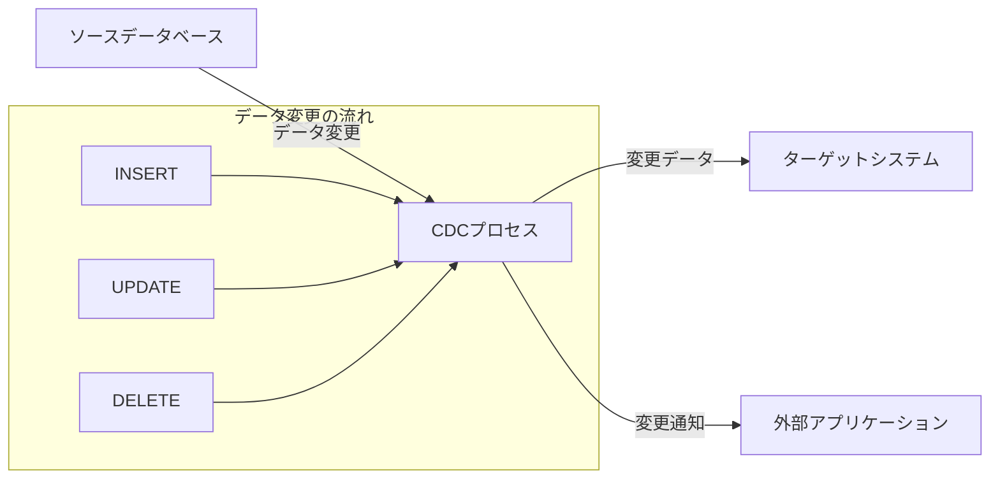
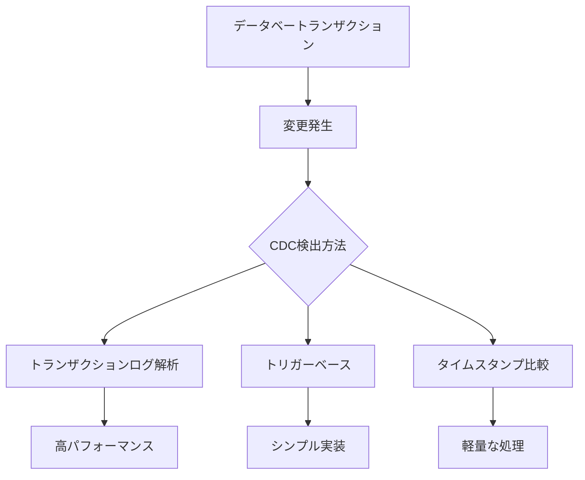
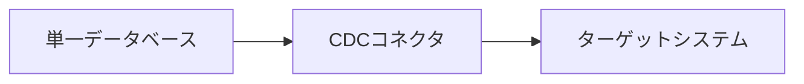
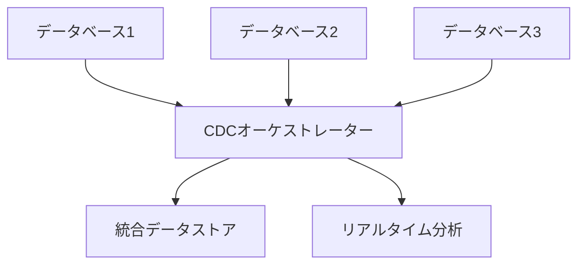

# CDC（Change Data Capture）の詳細解説

## 1. CDCとは何か？

### 1.1. 基本定義
**CDC（Change Data Capture）** とは、データベース内で発生したデータ変更（INSERT、UPDATE、DELETE）を検出し、その変更内容を他のシステムやアプリケーションに通知する技術です。

### 1.2. 核心的な概念


## 2. CDCの主要な目的と価値

### 2.1. 主な目的
- **リアルタイムデータ同期**: 複数システム間のデータ一貫性維持
- **イベント駆動アーキテクチャ**: データ変更をイベントとして伝播
- **データパイプライン**: データウェアハウスや分析システムへのデータ供給
- **監査と追跡**: データ変更の履歴管理

### 2.2. ビジネス価値
| 価値 | 説明 |
|------|------|
| **リアルタイム性** | バッチ処理より迅速なデータ反映 |
| **効率性** | 全データ転送ではなく変更分のみ転送 |
| **信頼性** | データ損失のリスク低減 |
| **拡張性** | 分散システム間の連携が容易 |

## 3. CDCの動作原理

### 3.1. 変更検出メカニズム


### 3.2. 変更データの形式
```json
{
  "operation": "UPDATE",
  "table": "users",
  "timestamp": "2024-03-15T10:30:00Z",
  "before": {
    "id": 123,
    "name": "山田太郎",
    "email": "old@example.com"
  },
  "after": {
    "id": 123, 
    "name": "山田太郎",
    "email": "new@example.com"
  },
  "transaction_id": "txn-789"
}
```

## 4. CDCの主要な実装方式

### 4.1. トランザクションログ解析方式
**特徴**:
- データベースのトランザクションログ（WAL）を解析
- パフォーマンス影響が少ない
- 包括的な変更情報を取得可能

**例（PostgreSQL）**:
```sql
-- 論理レプリケーションの設定
ALTER SYSTEM SET wal_level = logical;
CREATE PUBLICATION cdc_publication FOR ALL TABLES;
```

### 4.2. トリガーベース方式
**特徴**:
- データベートリガーを使用して変更を捕捉
- 実装が比較的簡単
- パフォーマンスに影響する可能性あり

**例**:
```sql
CREATE TRIGGER user_cdc_trigger
AFTER INSERT OR UPDATE OR DELETE ON users
FOR EACH ROW EXECUTE FUNCTION cdc_audit_function();
```

### 4.3. タイムスタンプ/バージョン方式
**特徴**:
- 最終更新時刻やバージョン番号で変更を検出
- シンプルな実装
- 削除操作の検出が困難

**例**:
```sql
SELECT * FROM orders 
WHERE last_updated > '2024-03-15T00:00:00Z';
```

## 5. CDCのアーキテクチャパターン

### 5.1. 単一データベースCDC


### 5.2. 分散データベースCDC


## 6. CDCのユースケース

### 6.1. マイクロサービス間データ同期
```java
// 注文サービスでのデータ変更
@Service
public class OrderService {
    public Order createOrder(OrderRequest request) {
        Order order = orderRepository.save(createOrderFromRequest(request));
        // CDCを通じて他のサービスに通知
        return order;
    }
}
```

### 6.2. リアルタイム分析とレポート
```sql
-- 分析データベースへのリアルタイム反映
INSERT INTO analytics.sales_dashboard
SELECT * FROM cdc_stream 
WHERE operation = 'INSERT' AND table = 'orders';
```

### 6.3. データレイク/データウェアハウス連携
```python
# データレイクへのストリーミング
def stream_to_datalake(change_data):
    s3_client.put_object(
        Bucket='datalake-bucket',
        Key=f'changes/{change_data["table"]}/{change_data["timestamp"]}.json',
        Body=json.dumps(change_data)
    )
```

## 7. CDCのメリットと課題

### 7.1. メリット
| メリット | 説明 |
|----------|------|
| **リアルタイム性** | 即時のデータ反映 |
| **効率性** | 変更データのみ転送 |
| **信頼性** | トランザクション整合性維持 |
| **拡張性** | 多様なターゲットシステム対応 |

### 7.2. 課題と対策
| 課題 | 対策 |
|------|------|
| **パフォーマンス影響** | 適切なCDC方式の選択 |
| **データ整合性** | 冪等性処理の実装 |
| **ネットワーク遅延** | 非同期処理とリトライ機制 |
| **スケーラビリティ** | 分散CDCアーキテクチャ |

## 8. 主要なCDCツールと技術

### 8.1. オープンソースツール
- **Debezium**: トランザクションログベースのCDC
- **Maxwell**: MySQL用CDCツール
- **Canal**: Alibaba製のMySQL CDC

### 8.2. クラウドサービス
- **AWS DMS**: Amazon Data Migration Service
- **Google Cloud Dataflow**: ストリーム処理サービス
- **Azure Data Factory**: データ統合サービス

### 8.3. データベースネイティブ
- **PostgreSQL論理レプリケーション**
- **MySQLバイナリログレプリケーション**
- **Oracle GoldenGate**

## 9. CDCの設計考慮事項

### 9.1. パフォーマンス最適化
```java
// バッチ処理による最適化
@Scheduled(fixedDelay = 1000)
public void processChangesInBatch() {
    List<ChangeData> changes = changeRepository.findUnprocessedBatch(100);
    if (!changes.isEmpty()) {
        processBatch(changes);
    }
}
```

### 9.2. エラーハンドリングとリトライ
```yaml
# リトライ設定例
cdc:
  retry:
    max-attempts: 3
    initial-delay: 1000ms
    max-delay: 10000ms
    multiplier: 2.0
```

### 9.3. 監視とメトリクス
```prometheus
# Prometheusメトリクス例
cdc_changes_processed_total{table="users",operation="INSERT"}
cdc_processing_duration_seconds_bucket{le="0.1"}
cdc_error_total{error_type="network_timeout"}
```

## 10. 業界での応用事例

### 10.1. eコマースプラットフォーム
- 在庫情報のリアルタイム更新
- 注文状態の即時反映
- 顧客行動のリアルタイム分析

### 10.2. 金融サービス
- 取引データの即時処理
- 不正検出のためのデータストリーミング
- コンプライアンス監査のための変更追跡

### 10.3. ヘルスケア
- 患者データのリアルタイム同期
- 医療記録の変更履歴管理
- 研究データの収集と分析

---
**CDCの本質**: データベースの変更を「イベント」として捉え、それを効果的に伝播・活用する技術です。現代の分散システムにおいて、データの一貫性とリアルタイム性を両立させる重要な基盤技術となっています。
