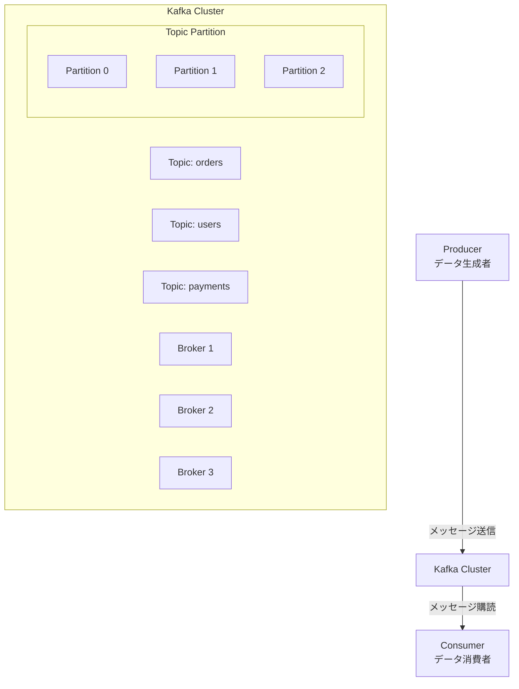
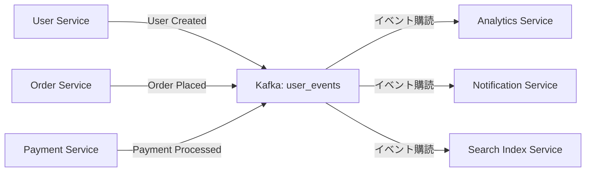
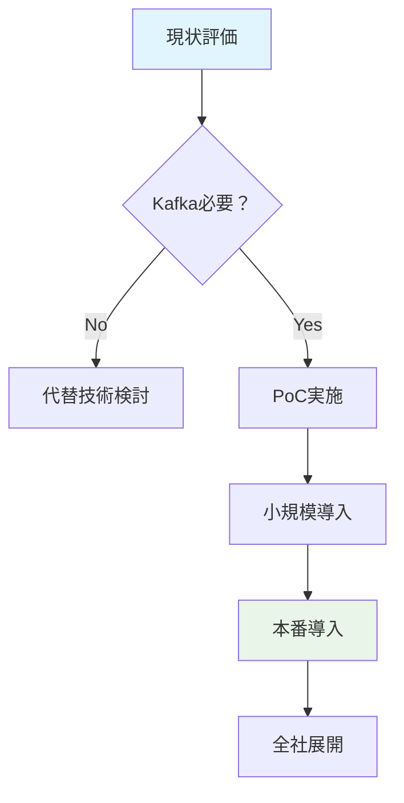

# Apache Kafka とは？導入必要性の評価

## 1. Apache Kafka の基本概念

### 1.1. Kafka とは何か？
Apache Kafkaは**分散型イベントストリーミングプラットフォーム**です。元々LinkedInで開発され、現在はApacheソフトウェア財団のトップレベルプロジェクトとして開発されています。

### 1.2. コアコンセプト


## 2. Kafka の主要コンポーネント

### 2.1. 基本コンポーネント
| コンポーネント | 説明 |
|----------------|------|
| **Topic** | メッセージのカテゴリやフィード名 |
| **Partition** | Topicを水平分割した単位 |
| **Producer** | メッセージを送信するクライアント |
| **Consumer** | メッセージを受信するクライアント |
| **Broker** | Kafkaサーバーインスタンス |
| **ZooKeeper** | メタデータ管理（Kafka 3.0以降では不要に） |

## 3. Kafka の特徴とメリット

### 3.1. 技術的特長
```java
// Kafkaのプロデューサー例（Java）
Properties props = new Properties();
props.put("bootstrap.servers", "kafka1:9092,kafka2:9092");
props.put("key.serializer", "org.apache.kafka.common.serialization.StringSerializer");
props.put("value.serializer", "org.apache.kafka.common.serialization.StringSerializer");

Producer<String, String> producer = new KafkaProducer<>(props);

// メッセージ送信
producer.send(new ProducerRecord<>("orders", "order-123", 
    "{\"userId\": \"user-456\", \"amount\": 100.0}"));
```

### 3.2. 主なメリット
- **高スループット**: 1秒あたり数百万メッセージ処理
- **低レイテンシ**: ミリ秒単位の応答時間
- **耐久性**: メッセージの永続的保存
- **スケーラビリティ**: 水平スケーリングが容易
- **フォールトトレランス**: 自動フェイルオーバー

## 4. マイクロサービスでのKafka活用シナリオ

### 4.1. 典型的なユースケース


### 4.2. 具体的な活用例
- **イベント駆動アーキテクチャ**: サービス間の非同期通信
- **データパイプライン**: データ収集と変換
- **リアルタイム処理**: ストリーム処理と分析
- **ログ集約**: 分散システムのログ収集

## 5. Kafka導入の必要性評価

### 5.1. 導入が必要な場合
| シナリオ | 説明 |
|----------|------|
| **高トラフィック** | 1秒あたり数千以上のメッセージ処理 |
| **複数サービス連携** | 3つ以上のマイクロサービス間連携 |
| **リアルタイム処理** | 即時のデータ処理と分析が必要 |
| **データ永続性** | メッセージの消失が許されない |

### 5.2. 導入が過剰な場合
| シナリオ | 代替案 |
|----------|--------|
| **小規模システム** | PostgreSQLのNOTIFY/LISTEN |
| **低トラフィック** | RabbitMQ, Redis Pub/Sub |
| **同期通信中心** | REST API, gRPC |
| **シンプルなキュー** | Amazon SQS, Redis Queue |

## 6. Kafka vs 他の技術スタック

### 6.1. 技術比較表
| 技術 | 用途 | スループット | レイテンシ | 学習コスト |
|------|------|-------------|-----------|------------|
| **Kafka** | イベントストリーミング | 非常に高い | 低い | 高い |
| **RabbitMQ** | メッセージキュー | 高い | 非常に低い | 中程度 |
| **Redis Pub/Sub** | 簡易Pub/Sub | 高い | 非常に低い | 低い |
| **PostgreSQL NOTIFY** | データベースイベント | 低い | 低い | 低い |

## 7. 導入コストと複雑さ

### 7.1. 考慮すべきコスト要因
```yaml
# 導入コストの内訳
infrastructure_cost:
  - kafka_cluster: 3ノード以上推奨
  - zookeeper: 3ノード（Kafka 2.8以前）
  - monitoring: Prometheus, Grafana
  - storage: 永続ストレージ

operational_cost:
  - administration: 専門知識が必要
  - monitoring: 24/7監視
  - troubleshooting: 複雑な問題解決

development_cost:
  - learning_curve:  steep
  - implementation:  producer/consumer実装
  - testing:  分散環境でのテスト
```

## 8. 段階的導入アプローチ

### 8.1. 導入ロードマップ例


### 8.2. 段階的導入ステップ
1. **PoC（概念実証）**: 単一ユースケースで検証
2. **開発環境導入**: 開発者が習熟する時間を確保
3. **本番一部導入**: 重要度の低いサービスから
4. **全社展開**: 段階的に拡大

## 9. 代替技術オプション

### 9.1. Kafkaの代替案
**小規模システム向け:**
```sql
-- PostgreSQL NOTIFY/LISTENの例
-- サービスA: イベント通知
NOTIFY user_created, '{"userId": "123", "email": "user@example.com"}';

-- サービスB: イベント監視
LISTEN user_created;
```

**中規模システム向け:**
- **RabbitMQ**: 複雑なルーティングが必要な場合
- **AWS SNS/SQS**: クラウド環境なら管理が容易
- **NATS**: 軽量で高速なPub/Subシステム

## 10. 導入判断チェックリスト

### 10.1. 導入を推奨する条件
- [ ] 1秒あたり1,000以上のメッセージ処理
- [ ] 5つ以上のマイクロサービス間連携
- [ ] メッセージの永続的保存が必要
- [ ] リアルタイム処理要件がある
- [ ] 専門知識を持ったチームがいる

### 10.2. 導入を見送る条件
- [ ] 小規模なモノリスまたは2-3のマイクロサービス
- [ ] 1秒あたり100以下のメッセージ処理
- [ ] 同期的な通信が主流
- [ ] リソースと専門知識が不足

---
**結論**: 
Kafkaは強力なツールですが、**「技術選定のための技術選定」** になる危険性があります。現在のシステム規模、将来の成長予測、チームの専門性を総合的に評価して決定してください。

**まずはPoCを実施**し、実際のワークロードで評価することを強く推奨します。
