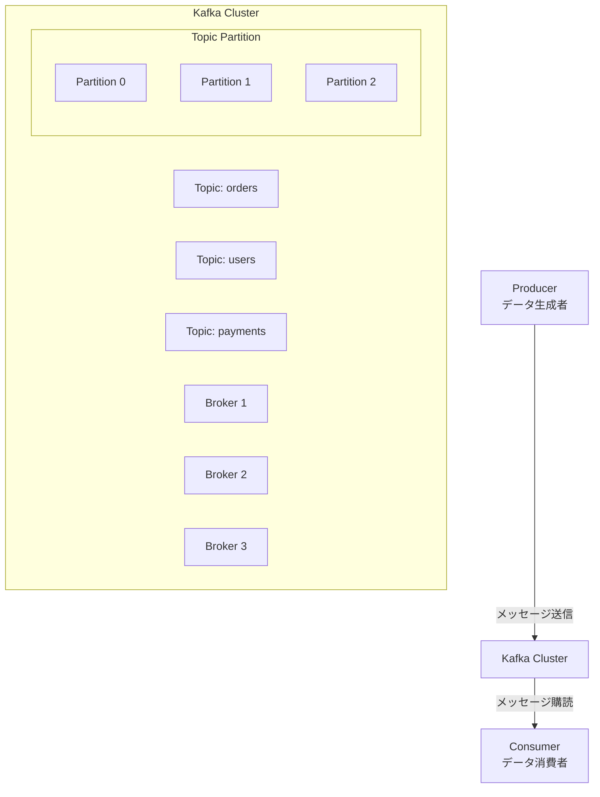
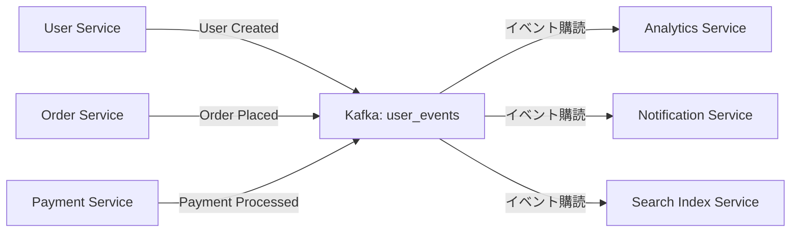
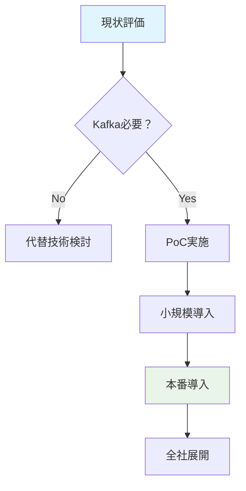
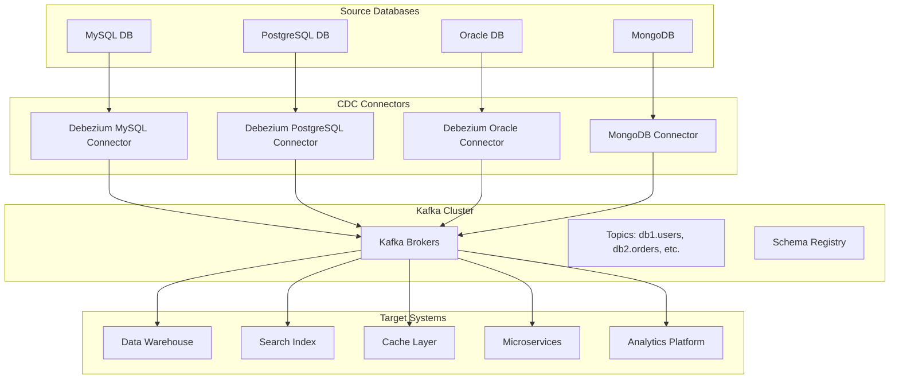

# Apache Kafka とは？導入必要性の評価

## 1. Apache Kafka の基本概念

### 1.1. Kafka とは何か？
Apache Kafkaは**分散型イベントストリーミングプラットフォーム**です。元々LinkedInで開発され、現在はApacheソフトウェア財団のトップレベルプロジェクトとして開発されています。

### 1.2. コアコンセプト


## 2. Kafka の主要コンポーネント

### 2.1. 基本コンポーネント
| コンポーネント | 説明 |
|----------------|------|
| **Topic** | メッセージのカテゴリやフィード名 |
| **Partition** | Topicを水平分割した単位 |
| **Producer** | メッセージを送信するクライアント |
| **Consumer** | メッセージを受信するクライアント |
| **Broker** | Kafkaサーバーインスタンス |
| **ZooKeeper** | メタデータ管理（Kafka 3.0以降では不要に） |

## 3. Kafka の特徴とメリット

### 3.1. 技術的特長
```java
// Kafkaのプロデューサー例（Java）
Properties props = new Properties();
props.put("bootstrap.servers", "kafka1:9092,kafka2:9092");
props.put("key.serializer", "org.apache.kafka.common.serialization.StringSerializer");
props.put("value.serializer", "org.apache.kafka.common.serialization.StringSerializer");

Producer<String, String> producer = new KafkaProducer<>(props);

// メッセージ送信
producer.send(new ProducerRecord<>("orders", "order-123", 
    "{\"userId\": \"user-456\", \"amount\": 100.0}"));
```

### 3.2. 主なメリット
- **高スループット**: 1秒あたり数百万メッセージ処理
- **低レイテンシ**: ミリ秒単位の応答時間
- **耐久性**: メッセージの永続的保存
- **スケーラビリティ**: 水平スケーリングが容易
- **フォールトトレランス**: 自動フェイルオーバー

## 4. マイクロサービスでのKafka活用シナリオ

### 4.1. 典型的なユースケース


### 4.2. 具体的な活用例
- **イベント駆動アーキテクチャ**: サービス間の非同期通信
- **データパイプライン**: データ収集と変換
- **リアルタイム処理**: ストリーム処理と分析
- **ログ集約**: 分散システムのログ収集

## 5. Kafka導入の必要性評価

### 5.1. 導入が必要な場合
| シナリオ | 説明 |
|----------|------|
| **高トラフィック** | 1秒あたり数千以上のメッセージ処理 |
| **複数サービス連携** | 3つ以上のマイクロサービス間連携 |
| **リアルタイム処理** | 即時のデータ処理と分析が必要 |
| **データ永続性** | メッセージの消失が許されない |

### 5.2. 導入が過剰な場合
| シナリオ | 代替案 |
|----------|--------|
| **小規模システム** | PostgreSQLのNOTIFY/LISTEN |
| **低トラフィック** | RabbitMQ, Redis Pub/Sub |
| **同期通信中心** | REST API, gRPC |
| **シンプルなキュー** | Amazon SQS, Redis Queue |

## 6. Kafka vs 他の技術スタック

### 6.1. 技術比較表
| 技術 | 用途 | スループット | レイテンシ | 学習コスト |
|------|------|-------------|-----------|------------|
| **Kafka** | イベントストリーミング | 非常に高い | 低い | 高い |
| **RabbitMQ** | メッセージキュー | 高い | 非常に低い | 中程度 |
| **Redis Pub/Sub** | 簡易Pub/Sub | 高い | 非常に低い | 低い |
| **PostgreSQL NOTIFY** | データベースイベント | 低い | 低い | 低い |

## 7. 導入コストと複雑さ

### 7.1. 考慮すべきコスト要因
```yaml
# 導入コストの内訳
infrastructure_cost:
  - kafka_cluster: 3ノード以上推奨
  - zookeeper: 3ノード（Kafka 2.8以前）
  - monitoring: Prometheus, Grafana
  - storage: 永続ストレージ

operational_cost:
  - administration: 専門知識が必要
  - monitoring: 24/7監視
  - troubleshooting: 複雑な問題解決

development_cost:
  - learning_curve:  steep
  - implementation:  producer/consumer実装
  - testing:  分散環境でのテスト
```

## 8. 段階的導入アプローチ

### 8.1. 導入ロードマップ例


### 8.2. 段階的導入ステップ
1. **PoC（概念実証）**: 単一ユースケースで検証
2. **開発環境導入**: 開発者が習熟する時間を確保
3. **本番一部導入**: 重要度の低いサービスから
4. **全社展開**: 段階的に拡大

## 9. 代替技術オプション

### 9.1. Kafkaの代替案
**小規模システム向け:**
```sql
-- PostgreSQL NOTIFY/LISTENの例
-- サービスA: イベント通知
NOTIFY user_created, '{"userId": "123", "email": "user@example.com"}';

-- サービスB: イベント監視
LISTEN user_created;
```

**中規模システム向け:**
- **RabbitMQ**: 複雑なルーティングが必要な場合
- **AWS SNS/SQS**: クラウド環境なら管理が容易
- **NATS**: 軽量で高速なPub/Subシステム

## 10. 導入判断チェックリスト

### 10.1. 導入を推奨する条件
- [ ] 1秒あたり1,000以上のメッセージ処理
- [ ] 5つ以上のマイクロサービス間連携
- [ ] メッセージの永続的保存が必要
- [ ] リアルタイム処理要件がある
- [ ] 専門知識を持ったチームがいる

### 10.2. 導入を見送る条件
- [ ] 小規模なモノリスまたは2-3のマイクロサービス
- [ ] 1秒あたり100以下のメッセージ処理
- [ ] 同期的な通信が主流
- [ ] リソースと専門知識が不足

---
**結論**: 
Kafkaは強力なツールですが、**「技術選定のための技術選定」** になる危険性があります。現在のシステム規模、将来の成長予測、チームの専門性を総合的に評価して決定してください。

**まずはPoCを実施**し、実際のワークロードで評価することを強く推奨します。

---
# Kafkaを利用した分散データベースCDC設計

## 1. アーキテクチャ概要

### 1.1. 全体構成


## 2. コアコンポーネントの設計

### 2.1. Debeziumコネクター設定
```yaml
# debezium-mysql-connector.json
{
  "name": "mysql-cdc-connector",
  "config": {
    "connector.class": "io.debezium.connector.mysql.MySqlConnector",
    "database.hostname": "mysql-host",
    "database.port": "3306",
    "database.user": "cdc_user",
    "database.password": "${CDC_PASSWORD}",
    "database.server.id": "184054",
    "database.server.name": "mysql-server",
    "database.include.list": "inventory,orders",
    "table.include.list": "inventory.users,inventory.products",
    "database.history.kafka.bootstrap.servers": "kafka-broker1:9092,kafka-broker2:9092",
    "database.history.kafka.topic": "dbhistory.mysql",
    "include.schema.changes": "true",
    "transforms": "unwrap",
    "transforms.unwrap.type": "io.debezium.transforms.ExtractNewRecordState",
    "transforms.unwrap.drop.tombstones": "false",
    "transforms.unwrap.delete.handling.mode": "drop"
  }
}
```

### 2.2. Kafkaトピック設計
```bash
# トピック命名規則
db_{server-name}_{database-name}_{table-name}

# トピック作成例
kafka-topics.sh --create \
  --bootstrap-server kafka-broker:9092 \
  --topic db_mysql_inventory_users \
  --partitions 6 \
  --replication-factor 3 \
  --config retention.ms=604800000 \
  --config cleanup.policy=delete

kafka-topics.sh --create \
  --bootstrap-server kafka-broker:9092 \
  --topic db_mysql_inventory_products \
  --partitions 4 \
  --replication-factor 3
```

## 3. データフォーマットとSchema Registry

### 3.1. Avroスキーマ定義
```json
{
  "type": "record",
  "name": "Envelope",
  "namespace": "com.company.cdc",
  "fields": [
    {
      "name": "before",
      "type": ["null", {
        "type": "record",
        "name": "Value",
        "fields": [
          {"name": "id", "type": "int"},
          {"name": "name", "type": "string"},
          {"name": "email", "type": "string"},
          {"name": "created_at", "type": "long", "logicalType": "timestamp-millis"}
        ]
      }],
      "default": null
    },
    {
      "name": "after",
      "type": ["null", "Value"],
      "default": null
    },
    {
      "name": "source",
      "type": {
        "type": "record",
        "name": "Source",
        "fields": [
          {"name": "version", "type": "string"},
          {"name": "connector", "type": "string"},
          {"name": "name", "type": "string"},
          {"name": "ts_ms", "type": "long"},
          {"name": "snapshot", "type": "boolean"},
          {"name": "db", "type": "string"},
          {"name": "table", "type": "string"}
        ]
      }
    },
    {
      "name": "op",
      "type": "string"
    },
    {
      "name": "ts_ms",
      "type": "long"
    }
  ]
}
```

### 3.2. メッセージ例
```json
{
  "before": null,
  "after": {
    "id": 1001,
    "name": "山田太郎",
    "email": "yamada@example.com",
    "created_at": 1647312000000
  },
  "source": {
    "version": "1.9.0.Final",
    "connector": "mysql",
    "name": "mysql-server",
    "ts_ms": 1647312001000,
    "snapshot": "false",
    "db": "inventory",
    "table": "users"
  },
  "op": "c",
  "ts_ms": 1647312001000
}
```

## 4. コネクター管理とオーケストレーション

### 4.1. Kubernetesデプロイメント
```yaml
apiVersion: apps/v1
kind: Deployment
metadata:
  name: debezium-connector
spec:
  replicas: 3
  selector:
    matchLabels:
      app: debezium-connector
  template:
    metadata:
      labels:
        app: debezium-connector
    spec:
      containers:
      - name: connector
        image: debezium/connect:1.9
        env:
        - name: BOOTSTRAP_SERVERS
          value: "kafka-broker1:9092,kafka-broker2:9092"
        - name: GROUP_ID
          value: "cdc-connectors"
        - name: CONFIG_STORAGE_TOPIC
          value: "connect-configs"
        - name: OFFSET_STORAGE_TOPIC
          value: "connect-offsets"
        - name: STATUS_STORAGE_TOPIC
          value: "connect-status"
        - name: KEY_CONVERTER
          value: "io.confluent.connect.avro.AvroConverter"
        - name: VALUE_CONVERTER
          value: "io.confluent.connect.avro.AvroConverter"
        - name: CONNECT_KEY_CONVERTER_SCHEMA_REGISTRY_URL
          value: "http://schema-registry:8081"
        - name: CONNECT_VALUE_CONVERTER_SCHEMA_REGISTRY_URL
          value: "http://schema-registry:8081"
        ports:
        - containerPort: 8083
---
apiVersion: v1
kind: Service
metadata:
  name: debezium-connect
spec:
  selector:
    app: debezium-connector
  ports:
  - port: 8083
    targetPort: 8083
```

## 5. データ処理と変換

### 5.1. Kafka Streamsによるデータ変換
```java
public class CDCStreamProcessor {

    @Override
    public Topology buildTopology() {
        StreamsBuilder builder = new StreamsBuilder();
        
        // ユーザーデータのストリーム処理
        KStream<String, GenericRecord> userStream = builder.stream(
            "db_mysql_inventory_users",
            Consumed.with(Serdes.String(), avroSerde)
        );
        
        // データ変換とエンリッチメント
        KStream<String, EnrichedUser> enrichedStream = userStream
            .filter((key, value) -> value != null)
            .mapValues(this::enrichUserData)
            .filter((key, value) -> value != null);
        
        // ターゲットトピックへ出力
        enrichedStream.to(
            "enriched_users",
            Produced.with(Serdes.String(), enrichedUserSerde)
        );
        
        return builder.build();
    }
    
    private EnrichedUser enrichUserData(GenericRecord record) {
        try {
            String operation = record.get("op").toString();
            GenericRecord after = (GenericRecord) record.get("after");
            
            if ("d".equals(operation) || after == null) {
                return null; // 削除操作はスキップ
            }
            
            EnrichedUser enriched = new EnrichedUser();
            enriched.setUserId((Integer) after.get("id"));
            enriched.setUserName((String) after.get("name"));
            enriched.setUserEmail((String) after.get("email"));
            enriched.setRegion(calculateRegionFromEmail((String) after.get("email")));
            enriched.setEventTime(System.currentTimeMillis());
            
            return enriched;
        } catch (Exception e) {
            log.error("Error enriching user data", e);
            return null;
        }
    }
}
```

## 6. エラーハンドリングとリトライ

### 6.1. Dead Letter Queue (DLQ) 設定
```yaml
# コネクターのDLQ設定
{
  "name": "mysql-cdc-connector",
  "config": {
    # ... 既存の設定 ...
    "errors.tolerance": "all",
    "errors.deadletterqueue.topic.name": "cdc-errors",
    "errors.deadletterqueue.topic.replication.factor": "3",
    "errors.deadletterqueue.context.headers.enable": "true",
    "errors.retry.delay.max.ms": "60000",
    "errors.retry.timeout": "300000"
  }
}
```

### 6.2. リトライメカニズム
```java
@Component
public class RetryableCDCConsumer {

    private final KafkaTemplate<String, String> kafkaTemplate;
    private final ObjectMapper objectMapper;
    
    @Retryable(
        value = {DataProcessingException.class},
        maxAttempts = 3,
        backoff = @Backoff(delay = 1000, multiplier = 2)
    )
    @KafkaListener(topics = "db_mysql_inventory_users")
    public void consumeUserChange(String message) {
        try {
            UserChange change = objectMapper.readValue(message, UserChange.class);
            processUserChange(change);
        } catch (Exception e) {
            throw new DataProcessingException("Failed to process user change", e);
        }
    }
    
    @Recover
    public void recover(DataProcessingException e, String message) {
        log.error("Failed to process message after retries: {}", message, e);
        kafkaTemplate.send("cdc-errors", message);
    }
}
```

## 7. 監視とメトリクス

### 7.1. Prometheusメトリクス設定
```yaml
# prometheus.yml
scrape_configs:
  - job_name: 'kafka-connect'
    static_configs:
      - targets: ['debezium-connect:8083']
    metrics_path: '/metrics'
    
  - job_name: 'kafka-brokers'
    static_configs:
      - targets: ['kafka-broker1:9090', 'kafka-broker2:9090']
    
  - job_name: 'cdc-consumers'
    static_configs:
      - targets: ['consumer-app:8080']
```

### 7.2. 監視ダッシュボード
```json
{
  "dashboard": {
    "title": "CDC Pipeline Monitoring",
    "panels": [
      {
        "title": "Message Throughput",
        "type": "graph",
        "targets": [
          {
            "expr": "rate(kafka_consumer_consumer_bytes_total{topic=~\"db_.*\"}[5m])",
            "legendFormat": "{{topic}}"
          }
        ]
      },
      {
        "title": "Processing Latency",
        "type": "graph",
        "targets": [
          {
            "expr": "histogram_quantile(0.95, rate(cdc_processing_latency_seconds_bucket[5m]))",
            "legendFormat": "95th percentile"
          }
        ]
      },
      {
        "title": "Error Rate",
        "type": "singlestat",
        "targets": [
          {
            "expr": "rate(cdc_errors_total[5m])",
            "format": "rate"
          }
        ]
      }
    ]
  }
}
```

## 8. セキュリティ設計

### 8.1. SSL/TLS暗号化設定
```yaml
# Kafkaコネクターのセキュリティ設定
{
  "name": "secure-mysql-connector",
  "config": {
    # ... 既存の設定 ...
    "database.ssl.mode": "required",
    "database.ssl.truststore": "/etc/ssl/certs/kafka.truststore.jks",
    "database.ssl.truststore.password": "${SSL_TRUSTSTORE_PASSWORD}",
    "database.ssl.keystore": "/etc/ssl/certs/kafka.keystore.jks",
    "database.ssl.keystore.password": "${SSL_KEYSTORE_PASSWORD}",
    "kafka.security.protocol": "SSL",
    "kafka.ssl.truststore.location": "/etc/ssl/certs/kafka.truststore.jks",
    "kafka.ssl.truststore.password": "${SSL_TRUSTSTORE_PASSWORD}",
    "kafka.ssl.keystore.location": "/etc/ssl/certs/kafka.keystore.jks",
    "kafka.ssl.keystore.password": "${SSL_KEYSTORE_PASSWORD}"
  }
}
```

### 8.2. アクセス制御
```bash
# Kafka ACL設定
# コネクターのプロデューサー権限
kafka-acls.sh --bootstrap-server kafka-broker:9092 \
  --add --allow-principal User:debezium-connector \
  --operation Write --topic db_mysql_inventory_users

# コンシューマーの購読権限
kafka-acls.sh --bootstrap-server kafka-broker:9092 \
  --add --allow-principal User:analytics-service \
  --operation Read --group analytics-group \
  --topic db_mysql_inventory_users
```

## 9. パフォーマンス最適化

### 9.1. パーティショニング戦略
```java
// カスタムパーティショナー
public class UserIdPartitioner implements Partitioner {
    
    @Override
    public int partition(String topic, Object key, byte[] keyBytes, 
                       Object value, byte[] valueBytes, Cluster cluster) {
        List<PartitionInfo> partitions = cluster.partitionsForTopic(topic);
        int numPartitions = partitions.size();
        
        if (key instanceof String) {
            String userId = (String) key;
            // ユーザーIDに基づくパーティショニング
            return Math.abs(userId.hashCode()) % numPartitions;
        }
        
        return 0; // デフォルトパーティション
    }
}
```

### 9.2. バッチ処理とコンパクション
```yaml
# トピックのコンパクション設定
kafka-topics.sh --alter \
  --bootstrap-server kafka-broker:9092 \
  --topic db_mysql_inventory_users \
  --config cleanup.policy=compact \
  --config min.cleanable.dirty.ratio=0.1 \
  --config segment.ms=3600000 \
  --config min.compaction.lag.ms=300000
```

## 10. 障害復旧とバックアップ

### 10.1. コネクター状態の永続化
```sql
-- オフセットと構成のバックアップ
CREATE TABLE connect_offsets_backup (
    connector_name VARCHAR(255),
    topic VARCHAR(255),
    partition INTEGER,
    offset BIGINT,
    timestamp TIMESTAMP,
    PRIMARY KEY (connector_name, topic, partition)
);

CREATE TABLE connect_configs_backup (
    connector_name VARCHAR(255),
    config_key VARCHAR(255),
    config_value TEXT,
    PRIMARY KEY (connector_name, config_key)
);
```

### 10.2. ディザスタリカバリ計画
```bash
# コネクター設定のエクスポート
curl -X GET http://debezium-connect:8083/connectors/mysql-cdc-connector \
  -o mysql-connector-backup.json

# スキーマのバックアップ
kafka-avro-console-consumer --topic _schemas \
  --bootstrap-server kafka-broker:9092 \
  --from-beginning > schema-registry-backup.avro

# トピックデータのレプリケーション
kafka-mirror-maker.sh --consumer.config consumer.properties \
  --producer.config producer.properties \
  --whitelist "db_.*" \
  --num.streams 4
```

---
**このアーキテクチャの利点**:
- ✅ 複数データベースの統一的なCDC管理
- ✅ スケーラブルでフォールトトレラントな設計
- ✅ リアルタイムデータパイプラインの構築
- ✅ エンタープライズレベルの信頼性とセキュリティ

**運用上の考慮点**:
- スキーマ変更の管理とバージョン互換性
- ネットワーク帯域幅とデータボリュームの最適化
- 監視とアラートの包括的な実装
- 定期的なバックアップと障害復旧テストの実施
