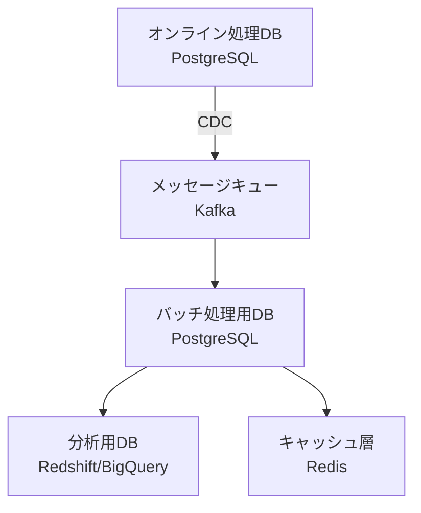

# マイクロサービスにおけるバッチ処理のデータベース設計

## 1. バッチ処理アーキテクチャ概要

### 1.1. 設計方針
- **分離原則**: オンライン処理とバッチ処理のデータベース分離
- **データフロー**: オンラインDB → バッチ処理用DB → 分析DB
- **非同期処理**: オンライン処理への影響最小化

## 2. バッチ処理データベース構成

### 2.1. データベース層の分離



### 2.2. データベース仕様

| データベース種別 | 用途 | 推奨技術 | データ保持期間 |
|-----------------|------|----------|----------------|
| オンラインDB | リアルタイム処理 | PostgreSQL | 6ヶ月～1年 |
| バッチ処理用DB | バッチ処理、集計 | PostgreSQL | 1年～3年 |
| 分析DB | レポート、分析 | Redshift/BigQuery | 永続 |
| キャッシュDB | 高速アクセス | Redis | 必要に応じて |

## 3. データフロー設計

### 3.1. Change Data Capture (CDC) 設定
```sql
-- PostgreSQL論理レプリケーション設定
-- postgresql.conf
wal_level = logical
max_replication_slots = 10
max_wal_senders = 10

-- パブリケーション作成
CREATE PUBLICATION batch_publication FOR ALL TABLES;

-- レプリケーションスロット作成
SELECT * FROM pg_create_logical_replication_slot(
    'batch_slot', 
    'pgoutput'
);
```

### 3.2. バッチ処理用DBスキーマ設計
```sql
-- バッチ処理専用スキーマ
CREATE SCHEMA batch;

-- ステージングテーブル
CREATE TABLE batch.staging_orders (
    id UUID,
    user_id UUID,
    amount DECIMAL(15,2),
    status VARCHAR(50),
    created_at TIMESTAMP,
    updated_at TIMESTAMP,
    batch_id VARCHAR(50),
    processed_at TIMESTAMP DEFAULT CURRENT_TIMESTAMP
);

-- 集計テーブル
CREATE TABLE batch.daily_sales (
    sale_date DATE,
    total_sales DECIMAL(15,2),
    order_count INT,
    average_order_value DECIMAL(10,2),
    last_updated TIMESTAMP
);

-- バッチ実行管理テーブル
CREATE TABLE batch.batch_executions (
    batch_id VARCHAR(50) PRIMARY KEY,
    batch_name VARCHAR(100),
    start_time TIMESTAMP,
    end_time TIMESTAMP,
    status VARCHAR(20),
    records_processed INT,
    error_message TEXT
);
```

## 4. バッチ処理パターン

### 4.1. バッチ処理タイプ別設計

**1. データ移行バッチ**
```python
# データ移行バッチ例
class DataMigrationBatch:
    def execute(self, batch_id):
        try:
            # オンラインDBからデータ抽出
            with online_db.cursor() as online_cur:
                online_cur.execute("""
                    SELECT * FROM orders 
                    WHERE created_at >= %s
                """, (last_batch_time,))
                
                # バッチ処理DBへ挿入
                with batch_db.cursor() as batch_cur:
                    for record in online_cur:
                        batch_cur.execute("""
                            INSERT INTO batch.staging_orders 
                            VALUES (%s, %s, %s, %s, %s, %s, %s)
                        """, (*record, batch_id))
            
            batch_db.commit()
            
        except Exception as e:
            batch_db.rollback()
            raise e
```

**2. 集計バッチ**
```sql
-- 日次売上集計バッチ
INSERT INTO batch.daily_sales
SELECT 
    DATE(created_at) as sale_date,
    SUM(amount) as total_sales,
    COUNT(*) as order_count,
    AVG(amount) as average_order_value,
    CURRENT_TIMESTAMP as last_updated
FROM batch.staging_orders 
WHERE created_at::date = CURRENT_DATE - INTERVAL '1 day'
GROUP BY DATE(created_at)
ON CONFLICT (sale_date) 
DO UPDATE SET
    total_sales = EXCLUDED.total_sales,
    order_count = EXCLUDED.order_count,
    average_order_value = EXCLUDED.average_order_value,
    last_updated = EXCLUDED.last_updated;
```

## 5. 性能最適化設計

### 5.1. インデックス設計
```sql
-- バッチ処理用インデックス
CREATE INDEX idx_batch_orders_created ON batch.staging_orders(created_at);
CREATE INDEX idx_batch_orders_batch_id ON batch.staging_orders(batch_id);
CREATE INDEX idx_batch_orders_processed ON batch.staging_orders(processed_at);

-- パーティショニング
CREATE TABLE batch.staging_orders_partitioned (
    -- カラム定義
) PARTITION BY RANGE (created_at);

-- 月次パーティション
CREATE TABLE batch.orders_2024_03 PARTITION OF batch.staging_orders_partitioned
FOR VALUES FROM ('2024-03-01') TO ('2024-04-01');
```

### 5.2. バッチ処理最適化
```ini
# postgresql.conf バッチ処理用設定
maintenance_work_mem = 1GB
work_mem = 128MB
effective_cache_size = 8GB
max_parallel_workers = 8
max_parallel_workers_per_gather = 4
```

## 6. 監視と管理

### 6.1. バッチ実行管理
```sql
-- バッチ実行状態管理テーブル
CREATE TABLE batch.batch_schedule (
    batch_name VARCHAR(100) PRIMARY KEY,
    cron_expression VARCHAR(50),
    last_execution TIMESTAMP,
    next_execution TIMESTAMP,
    enabled BOOLEAN DEFAULT true,
    timeout_minutes INT DEFAULT 60
);

-- バッチ実行履歴
CREATE TABLE batch.batch_execution_history (
    execution_id SERIAL PRIMARY KEY,
    batch_name VARCHAR(100),
    start_time TIMESTAMP,
    end_time TIMESTAMP,
    status VARCHAR(20),
    records_processed INT,
    error_message TEXT,
    execution_time INTERVAL
);
```

### 6.2. 監視クエリ
```sql
-- バッチ処理状態監視
SELECT 
    batch_name,
    status,
    start_time,
    age(NOW(), start_time) as running_time,
    records_processed
FROM batch.batch_executions 
WHERE end_time IS NULL;

-- パフォーマンス監視
SELECT 
    batch_name,
    AVG(EXTRACT(EPOCH FROM (end_time - start_time))) as avg_duration,
    MAX(records_processed) as max_records,
    COUNT(*) as execution_count
FROM batch.batch_execution_history 
WHERE start_time >= NOW() - INTERVAL '7 days'
GROUP BY batch_name;
```

## 7. エラーハンドリングとリトライ

### 7.1. バッチ処理エラーハンドリング
```python
class BatchProcessor:
    def execute_with_retry(self, batch_func, max_retries=3):
        for attempt in range(max_retries):
            try:
                return batch_func()
            except Exception as e:
                if attempt == max_retries - 1:
                    self.log_error(f"Batch failed after {max_retries} attempts: {e}")
                    raise
                self.log_warning(f"Batch attempt {attempt+1} failed: {e}")
                time.sleep(2 ** attempt)  # 指数バックオフ

    def log_batch_result(self, batch_id, status, records_processed, error_msg=None):
        self.db.execute("""
            INSERT INTO batch.batch_executions 
            VALUES (%s, %s, %s, %s, %s, %s)
        """, (batch_id, self.batch_name, status, records_processed, error_msg))
```

## 8. セキュリティ設計

### 8.1. アクセス制御
```sql
-- バッチ処理用ロール作成
CREATE ROLE batch_processor;

-- 最小権限の原則
GRANT CONNECT ON DATABASE batch_db TO batch_processor;
GRANT USAGE ON SCHEMA batch TO batch_processor;
GRANT SELECT, INSERT, UPDATE ON ALL TABLES IN SCHEMA batch TO batch_processor;
GRANT USAGE ON ALL SEQUENCES IN SCHEMA batch TO batch_processor;

-- オンラインDBへの読み取り専用アクセス
GRANT CONNECT ON DATABASE online_db TO batch_processor;
GRANT USAGE ON SCHEMA public TO batch_processor;
GRANT SELECT ON ALL TABLES IN SCHEMA public TO batch_processor;
```

## 9. バックアップとリカバリ

### 9.1. バッチ処理DBのバックアップ戦略
```bash
# バッチ処理DBのバックアップスクリプト
#!/bin/bash
# 日次差分バックアップ
pg_dump -Fc -h batch-db-host -U batch_user batch_db \
  -f /backup/batch_db_$(date +%Y%m%d).dump

# 週次フルバックアップ
pg_dump -Fc -h batch-db-host -U batch_user batch_db \
  -f /backup/batch_db_full_$(date +%Y%m%d).dump

# バックアップローテーション
find /backup -name "*.dump" -mtime +30 -delete
```

## 10. スケーリング戦略

### 10.1. 水平スケーリング
```yaml
# Kubernetesバッチジョブ設定例
apiVersion: batch/v1
kind: Job
metadata:
  name: daily-sales-batch
spec:
  parallelism: 3
  completions: 3
  template:
    spec:
      containers:
      - name: batch-processor
        image: batch-processor:latest
        env:
        - name: BATCH_PARTITION
          value: "0"  # パーティション番号
        resources:
          requests:
            memory: "2Gi"
            cpu: "1000m"
      restartPolicy: OnFailure
```

### 10.2. パーティショニング戦略
```sql
-- データパーティショニングによる並列処理
CREATE TABLE batch.orders_partitioned (
    id UUID,
    user_id UUID,
    amount DECIMAL(15,2),
    created_at TIMESTAMP,
    partition_key INT GENERATED ALWAYS AS (abs(hash(id)) % 10) STORED
) PARTITION BY LIST (partition_key);

-- 10個のパーティション作成
CREATE TABLE batch.orders_partition_0 PARTITION OF batch.orders_partitioned
FOR VALUES IN (0);
```

---
**重要な考慮事項**:
- オンライン処理への影響を最小化すること
- バッチ処理の実行時間帯をオフピーク時間に設定すること
- 適切な監視とアラート設定を実施すること
- 定期的なパフォーマンスチューニングを実施すること
