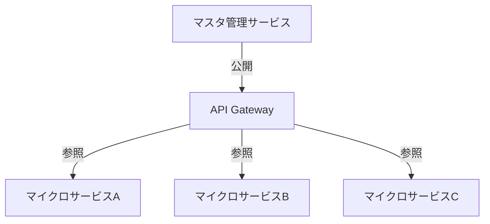
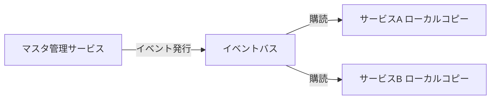

マイクロサービスにおけるデータベースマスタテーブル設計

マイクロサービスアーキテクチャでは、マスタデータの管理が重要な課題です。以下に効果的な設計パターンを提案します。

マスタデータの種類に応じた設計アプローチ

1. 参照専用マスタデータ（推奨）



実装例:

```python
# マスタ管理サービス
class MasterDataService:
    def get_product_info(self, product_id):
        # マスタデータを返す
        return db.query(Product).filter_by(id=product_id).first()

# 利用サービス側
class OrderService:
    def create_order(self, order_data):
        # API呼び出しでマスタデータ取得
        product_info = master_service.get_product_info(order_data.product_id)
        # 注文処理続行
```

2. データ重複パターン（高パフォーマンス向け）



実装例:

```sql
-- 各サービス内のローカルマスタテーブル
CREATE TABLE local_products (
    product_id VARCHAR(36) PRIMARY KEY,
    name VARCHAR(255),
    price DECIMAL(10,2),
    last_updated TIMESTAMP
);
```

```python
# マスタ更新イベント処理
@event_handler
def handle_product_updated(event):
    # ローカルコピーを更新
    LocalProduct.update_or_create(
        product_id=event.product_id,
        defaults={
            'name': event.name,
            'price': event.price,
            'last_updated': event.timestamp
        }
    )
```

設計パターン別詳細

パターン1: マスタ専用サービス

```python
# master_service/app.py
from flask import Flask, jsonify
app = Flask(__name__)

@app.route('/api/products/<product_id>', methods=['GET'])
def get_product(product_id):
    product = Product.query.get(product_id)
    return jsonify(product.to_dict())

@app.route('/api/products', methods=['POST'])
def update_product():
    # マスタデータ更新
    pass
```

パターン2: イベント駆動レプリケーション

```python
# マスタサービスでの更新処理
def update_product_price(product_id, new_price):
    product = Product.query.get(product_id)
    product.price = new_price
    db.session.commit()
    
    # イベント発行
    event_bus.publish('product_updated', {
        'product_id': product_id,
        'price': new_price,
        'timestamp': datetime.utcnow()
    })
```

キャッシュ戦略

Redisキャッシュの導入

```python
# マスタデータ取得時のキャッシュ利用
def get_product_with_cache(product_id):
    cache_key = f"product:{product_id}"
    cached_data = redis.get(cache_key)
    
    if cached_data:
        return json.loads(cached_data)
    
    product = db.query(Product).get(product_id)
    if product:
        # 1時間キャッシュ
        redis.setex(cache_key, 3600, json.dumps(product.to_dict()))
    
    return product
```

整合性保証のための設計

1. イベントソーシングパターン

```python
class ProductMaster:
    def __init__(self):
        self.changes = []
    
    def update_price(self, new_price):
        self.changes.append({
            'type': 'price_updated',
            'new_price': new_price,
            'timestamp': datetime.utcnow()
        })
    
    def get_current_state(self):
        # イベントから現在状態を再構築
        state = {'price': 0}
        for change in self.changes:
            if change['type'] == 'price_updated':
                state['price'] = change['new_price']
        return state
```

2. CDC（Change Data Capture）パターン

```sql
-- PostgreSQLの論理レプリケーションを活用
CREATE PUBLICATION master_publication FOR TABLE products, categories;

-- 各サービスで購読
CREATE SUBSCRIPTION service_a_subscription
CONNECTION 'host=master_db port=5432 dbname=master'
PUBLICATION master_publication;
```

サービス間のデータ依存性管理

バージョン管理の導入

```python
# マスタデータにバージョン情報を追加
class Product(Base):
    __tablename__ = 'products'
    id = Column(Integer, primary_key=True)
    name = Column(String(100))
    price = Column(Numeric(10,2))
    data_version = Column(Integer, default=1)
```

```http
GET /api/products/123
Accept: application/json; version=2

Response:
{
    "id": "123",
    "name": "Sample Product",
    "price": 1000,
    "metadata": {...},
    "_version": 2
}
```

フェデレーテッドクエリパターン

GraphQLの活用

```graphql
# マスタデータ用GraphQLスキーマ
type Product {
    id: ID!
    name: String!
    price: Float!
    category: Category!
}

type Query {
    product(id: ID!): Product
    products(categoryId: ID): [Product]
}
```

```python
# Apollo Federationでの実装
class Product(graphene.ObjectType):
    id = graphene.ID()
    name = graphene.String()
    price = graphene.Float()

class Query(graphene.ObjectType):
    product = graphene.Field(Product, id=graphene.ID(required=True))
    
    def resolve_product(self, info, id):
        return get_product_from_master(id)
```

監視と運用設計

データ整合性監視

```python
# 定期的な整合性チェック
def check_data_consistency():
    master_products = get_all_master_products()
    
    for service in ['order', 'inventory', 'catalog']:
        service_products = get_service_products(service)
        
        for master in master_products:
            service_data = service_products.get(master.id)
            if service_data and service_data.price != master.price:
                alert_inconsistency(master.id, service, 'price')
```

推奨アプローチ選択の判断基準

シナリオ 推奨パターン 理由
リアルタイム整合性必須 マスタ専用サービス + API呼び出し 常に最新データを提供
高パフォーマンス要求 イベント駆動レプリケーション ローカルアクセス可能
大規模データ CDCパターン 効率的なデータ同期
複雑なクエリ要求 GraphQLフェデレーション 柔軟なデータ取得

セキュリティ考慮事項

```sql
-- マスタデータへのアクセス制御
CREATE ROLE master_reader;
GRANT SELECT ON products TO master_reader;

CREATE ROLE master_writer;
GRANT SELECT, INSERT, UPDATE ON products TO master_writer;
```

```yaml
# APIゲートウェイでのレート制限
- name: master-api-rate-limit
  match: path = "/api/master/*"
  rate_limit:
    requests_per_unit: 100
    unit: MINUTE
```

このように、マイクロサービス環境ではマスタデータを単一の真理源として維持しつつ、各サービスが必要な形でデータを利用できるように設計することが重要です。