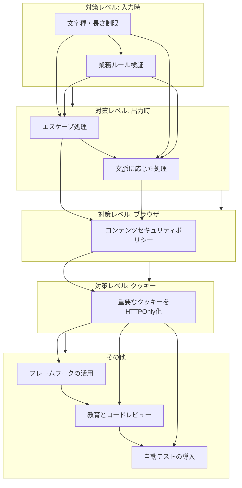

# XSS対策方式設計

**XSS（クロスサイトスクリプティング）対策**について、基本設計段階で考慮すべき方式設計を中心に、詳細かつ体系的に説明します。

---

## XSS対策方式設計とは

XSS対策方式設計は、Webアプリケーションの基本設計段階において、XSS脆弱性が混入することを予防し、万一混入した場合でも被害を軽減するための**技術的方針、コーディング規約、検証プロセス**を事前に定義する作業です。後付けの対策では根本的な解決が難しく、設計段階からの体系的なアプローチが不可欠です。

---

## XSSの種類と影響

対策を設計する前に、対象となる脆弱性を理解します。

| 種類 | 発動地点 | 影響例 | イメージ |
| :--- | :--- | :--- | :--- |
| **反射型XSS** | 被害者のブラウザ | 偽の警告の表示、クッキー値の窃取 | 攻撃リンクをメールで送り、クリックさせて発動 |
| **蓄積型XSS** | 被害者のブラウザ | サイトの改ざん、他ユーザーへの攻撃の拡散 | 掲示板の投稿内容に悪意あるスクリプトを仕込み、閲覧した全ユーザーに影響 |
| **DOM-based XSS** | 被害者のブラウザ | JavaScriptの操作による画面書き換え | URLのパラメータを元に画面表示を動的に変更する処理で発生 |

**影響**: セッションハイジャック、サイトの改ざん、偽のページの表示、マルウェア配布など。

---

## 基本設計段階での対策方針

多層防御（Defense in Depth）の観点から、以下のように複数の対策を組み合わせて設計します。



### 1. 入力値のバリデーション (入力時対策)
*   **方針**: 「信用できないすべての入力」を検証する。
*   **設計内容**:
    *   **文字種・長さ制限**: 設計段階で各入力項目の許容文字種（例：名前は英数字のみ、メールアドレスはemail形式）と最大長を定義する。ホワイトリスト方式（許可リスト方式）を採用する。
    *   **業務ロジックに基づく検証**: 数値範囲、日付の整合性など、アプリケーション固有のルールで検証する。
*   **注意点**: 入力値の「修正」は危険。エラー場合は拒否し、ユーザーに再入力を促す。バリデーションだけでXSSを完全に防ぐことはできないため、次の対策と組み合わせる。

### 2. エスケープ処理 (出力時対策) - **最重要**
*   **方針**: **データを出力する直前のコンテキスト（文脈）に応じて、適切なエスケープを行う**。
*   **設計内容**:
    *   **エスケープ処理の責任箇所を明確化**: テンプレートエンジンやUIフレームワークの機能で自動実行することを基本方針とする。やむを得ず自前で実装する場合、共通ライブラリとして提供し、実装のばらつきを防ぐ。
    *   **コンテキストごとのエスケープルールを定義**:
        | 出力コンテキスト | エスケープ処理 | 例 ( `<script>alert('XSS')</script>` の対策後 ) |
        | :--- | :--- | :--- |
        | **HTML要素内** | HTMLエンティティエンコーディング | `&lt;script&gt;alert&#x28;&#x27;XSS&#x27;&#x29;&lt;&#x2F;script&gt;` |
        | **HTML属性内** | HTMLエンティティエンコーディング (※ `"` や `'` もエスケープ) | `&lt;script&gt;alert&#x28;&#x27;XSS&#x27;&#x29;&lt;&#x2F;script&gt;` |
        | **JavaScript内部** | JavaScriptのUnicodeエスケープ | `\u003Cscript\u003Ealert\u0028\u0027XSS\u0027\u0029\u003C\u002Fscript\u003E` |
        | **URLクエリパラメータ** | URLエンコーディング | `%3Cscript%3Ealert%28%27XSS%27%29%3C%2Fscript%3E` |
        | **CSS内部** | CSSエスケープ | 専用のエスケープ処理を行う |

### 3. コンテンツセキュリティポリシー (CSP) - 被害軽減策
*   **方針**: 最後の砦。万一スクリプトが注入されても実行されないようにブラウザに指示する。
*   **設計内容**:
    *   HTTPレスポンスヘッダー `Content-Security-Policy` を設定する。
    *   **信頼できるスクリプト源の許可リストを定義**:
        ```http
        # 自社ドメインと信頼するCDNのみスクリプトの実行を許可し、インラインスクリプトやeval()を禁止するポリシーの例
        Content-Security-Policy: default-src 'self'; script-src 'self' https://trusted.cdn.example.com; object-src 'none';
        ```
    *   **レポート機能の採用**: `Content-Security-Policy-Report-Only` ヘッダーで本番環境に適用する前にポリシーの影響を監視する。
*   **効果**: たとえエスケープ漏れがあっても、CSPが正しく設定されていればスクリプトは実行されず、被害を大幅に軽減できる。

### 4. クッキーの保護
*   **方針**: セッションIDなどの重要なクッキーをJavaScriptからアクセスできないようにする。
*   **設計内容**:
    *   セッションクッキーには `HttpOnly` 属性を付与する。
        ```http
        # Set-Cookieヘッダーの例
        Set-Cookie: JSESSIONID=xxxxxxx; Secure; HttpOnly; SameSite=Strict
        ```
    *   これにより、JavaScriptで `document.cookie` を読まれて窃取されるリスクを防ぐ。

### 5. その他の重要な設計方針
*   **安全なフレームワーク・ライブラリの採用**: React, Vue.js, Angular などのモダンフレームワークや、Thymeleaf, JSFなどのテンプレートエンジンは、デフォルトでXSS対策（エスケープ）が組み込まれていることが多い。これらの使用を標準とし、`dangerouslySetInnerHTML` などの危険なAPIの使用ルールを厳格に定義する。
*   **DOM-based XSSへの対策**: ユーザー入力値を `innerHTML` や `document.write()` に直接代入しない。テキストを操作する場合は `textContent` を、HTMLを動的に操作する場合は信頼できるサニタイズライブラリ（例: DOMPurify）を使用することを規約で定める。
*   **エンコーディングの統一**: アプリケーション内部の文字コードをUTF-8に統一し、文字化けによるエスケープ漏れを防ぐ。

---

## 開発プロセスに組み込む対策

1.  **セキュアコーディング規約の制定**: 上記の方針を具体的なコーディングルールとして文書化し、全開発者が参照できるようにする。
2.  **教育とコードレビュー**: 開発者へのトレーニングと、レビュー時のチェックリストにXSS項目を追加する。
3.  **自動テストの導入**:
    *   **SAST (Static Application Security Testing)**: ソースコードスキャンツールでエスケープ漏れなどの潜在的な脆弱性を検出する。
    *   **DAST (Dynamic Application Security Testing)**: OWASP ZAPやBurp Suite等のスキャナで本番類似環境に対してXSSテストを自動実行する。
    *   **CI/CDパイプラインへの統合**: これらのテストを自動化し、脆弱性が混入したビルドを通さないようにする。

---

## まとめ: 設計で決めるべき重要事項

基本設計書には、少なくとも以下を明記すべきです。

*   **エスケープ処理の基本方針**: 「フレームワーク標準の機能を用いて、出力コンテキストに応じたエスケープを自動適用する」
*   **CSPポリシーの草案**: `script-src` や `default-src` の許可リストの初期案。
*   **危険なAPIの使用禁止リスト**: `innerHTML` などの使用は厳格にレビューする旨を記載。
*   **クッキー方針**: セッションIDは必ず `HttpOnly`, `Secure` 属性を付与する。

XSSは古典的な脆弱性ですが、今なお発生件数が最も多い脅威の一つです。**「入力検証」「出力エスケープ」「CSPによる被害軽減」** を多層的に組み合わせ、設計段階からその対策を組み込むことが、堅牢なWebアプリケーションを構築するための最良の方法です。
