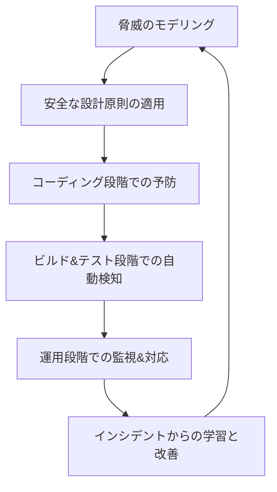

# 脆弱性対策方式設計

脆弱性対策方式設計について、詳細に説明いたします。

---

## 脆弱性対策方式設計とは

脆弱性対策方式設計とは、システムの基本設計段階において、ソフトウェアやシステムが内在する可能性のある脆弱性を体系的に特定し、それらを軽減または排除するための技術的・プロセス的な対策を事前に計画し、設計に組み込む作業です。これは単なる「バグ修正」ではなく、**脆弱性が発生しにくい設計**と、**発生した脆弱性を早期に発見・対処する仕組み**の両方を包含します。

---

## 設計の目的と基本原則

### 目的
- **予防**: 開発段階で脆弱性の混入を防ぐ
- **検知**: 混入した脆弱性を早期に発見する
- **対応**: 発見された脆弱性を迅速に修正する
- **継続的改善**: 対策そのものを不断に見直し、強化する

### 基本原則 (Shift-Left Security)
- **左側にシフトする**: テスト工程だけでなく、要求定義・設計・コーディングといった**開発ライフサイクルの可能な限り早い段階**でセキュリティを考慮する。
- **自動化**: 人的ミスを防ぎ、効率を高めるために、可能な限りプロセスを自動化する。
- **繰り返し**: セキュリティは一度きりの活動ではなく、継続的な活動として組み込む。

---

## 設計プロセスと主要ステップ

脆弱性対策は、以下のような多層的なアプローチで設計します。

### 1. 脅威のモデリング (Threat Modeling)
*   **目的**: システムの設計を理解し、潜在的な脅威と脆弱性を事前に発見する。
*   **手法**:
    *   **データフロー図 (DFD)** の作成: システムの構成要素、信頼の境界、データの流れを可視化する。
    *   **STRIDE** フレームワークを用いた分析:
        *   **S**poofing (偽装): 認証機制で対策
        *   **T**ampering (改ざん): 完全性機制で対策
        *   **R**epudiation (否認): 証跡機制で対策
        *   **I**nformation Disclosure (情報漏えい): 機密性機制で対策
        *   **D**enial of Service (サービス拒否): 可用性機制で対策
        *   **E**levation of Privilege (権限昇格): 認可機制で対策
    *   **リスク評価**: 特定された脅威について、発生しやすさと影響度からリスクを算定し、対策の優先順位を決定する。

### 2. 安全な設計原則の適用
*   **最小権限の原則**: ユーザーやプロセスに、必要な最小限の権限のみを付与する。
*   **防御の多層化 (Defense in Depth)**: 一つの対策が破られても、他の対策で防御できるように多重の防衛線を張る。
*   **失敗しても安全 (Fail-Safe Defaults)**: システムが故障またはエラーを起こした場合、セキュアな状態（たとえばアクセス拒否）に移行するように設計する。
*   **信頼領域の明確化と分離**: システム内部の信頼境界を明確にし、ネットワークセグメンテーション等で分離する。

### 3. コーディング段階での予防と検知
*   **安全なコーディング規約の制定と遵守**:
    *   OWASP Secure Coding Practices などを参考に、組織やプロジェクト独自のルールを定める。
    *   **例**: 入力値検証、パラメータ化クエリ（SQLインジェクション対策）、出力エンコーディング（XSS対策）、暗号論的強度のある乱数生成の使用など。
*   **セキュリティトレーニング**: 開発者に対して、一般的な脆弱性とその対策方法について定期的な教育を実施する。

### 4. ビルド・テスト段階での自動化された検知
*   **静的アプリケーションセキュリティテスト (SAST)**:
    *   ソースコードやバイナリを解析し、脆弱性のパターンを発見する「ホワイトボックステスト」。
    *   **ツール例**: SonarQube, Checkmarx, Fortify, SpotBugs (セキュリティプラグイン)
*   **動的アプリケーションセキュリティテスト (DAST)**:
    *   動作しているアプリケーションに対して外部からテストを実施し、脆弱性を発見する「ブラックボックステスト」。
    *   **ツール例**: OWASP ZAP, Burp Suite
*   **ソフトウェア構成分析 (SCA)**:
    *   プロジェクトが使用しているサードパーティ製ライブラリ（OSS）の依存関係を分析し、既知の脆弱性（CVE）がないかをチェックする。
    *   **ツール例**: Dependency-Check, Snyk, WhiteSource
*   **CI/CDパイプラインへの統合**:
    *   これらのテストツールをCI（継続的インテグレーション）パイプラインに組み込み、コミットやビルドのたびに自動でスキャンさせる。これにより、早期発見・早期修正が可能になる。

### 5. 運用・監視段階での対応
*   **脆弱性管理プロセスの設計**:
    *   スキャンツールや外部からの情報（CVE、JVNなど）で新たな脆弱性が判明した場合の、**評価・優先度付け・修正・再リリース**までの一連の流れを明確に定義する。
    *   対応時間の目標（SLA）を設定する。
*   **ワーキンググループの設立**: セキュリティチーム、開発チーム、オペレーションチームが連携する体制を整える。
*   **パッチ管理方針の策定**: OS、ミドルウェア、ライブラリに対する修正パッチの適用テストと本番適用のプロセスを定める。

### 6. インシデントからの学習と改善
*   発生したセキュリティインシデントや見逃された脆弱性を分析し、なぜ対策が機能しなかったのかを検証する（根本原因分析）。
*   分析結果を開発プロセスやチェックリストに反映させ、対策を強化する。

---

## 設計成果物

1.  **脅威モデル文書**: データフロー図、分析結果、対処方針を記録した文書。
2.  **セキュアコーディング規約**: プロジェクトで禁止・推奨するコーディング手法をまとめた文書またはチェックリスト。
3.  **セキュリティテスト計画書**: SAST/DAST/SCAの実施方法、ツール、合格基準を定義した文書。
4.  **脆弱性管理規程**: 脆弱性の発見から修正までのフローと役割を定義した文書。

---

## まとめ

脆弱性対策方式設計は、**「開発のごく早い段階から継続的かつ自動的に実施する、予防と検知の繰り返しプロセス」** です。単一の魔法のツールや方法論は存在せず、**脅威モデリングによる設計レビュー**、**コーディング規約と教育**、**自動化されたテストのCI/CDへの組み込み**、そして**明確な脆弱性管理プロセス**という、多角的な活動を組み合わせることで初めて効果を発揮します。

このように体系立てて設計することで、後工程での手戻りを減らし、セキュアで品質の高いシステムを効率的に開発することが可能になります。
