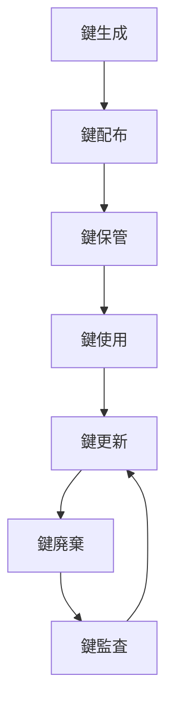
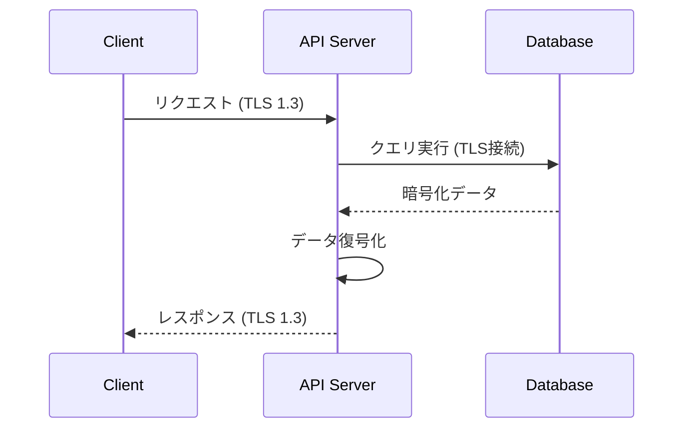

基本設計書: 暗号化・復号化システム（改訂版）

1. 概要

このドキュメントは、システム内で取り扱うデータおよび通信の暗号化・復号化に関する基本設計を記述したものです。AESを中心とした対称鍵暗号方式を採用し、対象範囲・方式・ライフサイクルを明確に定義します。

2. 対象範囲

2.1 暗号化対象データ

データ分類 具体例 必須暗号化 備考
機密データ 個人情報、認証情報、金融データ ○ 保存時・通信時ともに必須
重要データ 契約情報、社内文書、設定ファイル ○ 保存時・通信時ともに推奨
一般データ 公開情報、キャッシュデータ △ リスク評価に基づき判断
システムデータ ログ、監視データ △ 個人情報含む場合は必須

2.2 通信対象範囲

通信経路 暗号化要件 プロトコル例
外部公開API 必須 (TLS 1.2以上) HTTPS (TLS 1.3)
内部API通信 必須 HTTPS/mTLS
DB接続 必須 TLS/SSL対応接続
管理画面 必須 HTTPS (HSTS対応)
内部ネットワーク通信 推奨 VPN/IPSec

3. 暗号化方式

3.1 データ分類別方式

データ分類 保存時暗号化 通信時暗号化
機密データ AES-256-GCM TLS 1.3 (AES-256-GCM)
重要データ AES-256-CBC TLS 1.2 (AES-256-CBC)
一般データ 任意 (AES-128) TLS 1.2 (AES-128)
システムデータ ログ暗号化 (AES-256) SSH Tunnel/VPN

3.2 暗号化モード詳細

1. AES-GCM (推奨)
   · 認証付き暗号化
   · IV長: 12バイト推奨
   · タグ長: 16バイト
2. AES-CBC (レガシーシステム用)
   · PKCS7パディング必須
   · IVはランダム生成
3. 鍵導出 (PBKDF2)
   · パスワードから鍵を生成する場合
   · イテレーション数: 100,000回以上
   · ソルト長: 32バイト以上

4. 鍵管理設計

4.1 鍵ライフサイクル



4.2 鍵管理ポリシー

1. 鍵種別:
   · マスター鍵: HSMまたはKMSで管理
   · データ鍵: マスター鍵で暗号化して保管
   · セッション鍵: 一時使用のみ
2. ローテーション周期:
   · マスター鍵: 1年毎
   · データ鍵: 90日毎または1億回使用毎
   · セッション鍵: 1回限り
3. 保管方法:
   · クラウド環境: AWS KMS/Azure Key Vault
   · オンプレ環境: HSM (Hardware Security Module)
   · 開発環境: 環境変数 (Vault等と連携)

5. システム間連携

5.1 暗号化データフロー



5.2 エンドツーエンド暗号化

1. クライアント側暗号化:
   · WebCrypto API使用
   · クライアント鍵ペア生成 (RSA 2048bit以上)
   · サーバー公開鍵で暗号化
2. サーバー側処理:
   ```python
   def process_encrypted_data(encrypted_data):
       private_key = get_private_key_from_vault()
       session_key = rsa_decrypt(encrypted_data['key'], private_key)
       iv = encrypted_data['iv']
       ciphertext = encrypted_data['data']
       return aes_decrypt(ciphertext, session_key, iv)
   ```

6. セキュリティ基準

6.1 コンプライアンス対応

規格 要件 対応方式
PCI DSS カードデータ暗号化 AES-256 + HSM
GDPR 個人データ保護 擬似匿名化 + 暗号化
ISO27001 暗号化ポリシー 鍵管理含む包括的対応

6.2 監査要件

1. すべての暗号化操作のロギング
2. 鍵アクセス監査証跡 (Who/When/What)
3. 定期的な脆弱性診断 (TLS設定など)

7. 例外処理

7.1 エラーケース対応

エラー種別 対応方針
復号化失敗 アラート発報 + 3回リトライ後停止
鍵期限切れ 自動鍵更新プロセス起動
アルゴリズム非対応 フォールバック禁止、エラー返却

7.2 フォールバックポリシー

· 旧式アルゴリズムへのフォールバックを許可しない
· 互換性が必要な場合、デュアル暗号化方式を採用 (例: 新旧両方式で暗号化して保存)

8. 実装ガイドライン

8.1 禁止事項

· 独自暗号化アルゴリズムの実装禁止
· 固定IVの使用禁止
· 鍵のソースコード埋め込み禁止
· MD5/SHA1等の非推奨ハッシュ使用禁止

8.2 推奨プラクティス

```python
# 推奨実装例 (AES-GCM)
def encrypt_gcm(plaintext: str, key: bytes) -> dict:
    iv = get_random_bytes(12)  # GCM推奨IV長
    cipher = AES.new(key, AES.MODE_GCM, nonce=iv)
    ciphertext, tag = cipher.encrypt_and_digest(plaintext.encode())
    return {
        'iv': base64.b64encode(iv).decode(),
        'ciphertext': base64.b64encode(ciphertext).decode(),
        'tag': base64.b64encode(tag).decode()
    }
```

9. パフォーマンス考慮

9.1 ベンチマーク指標

操作 許容レイテンシ 備考
暗号化 (AES-256-GCM) < 5ms/1MB HWアクセラレーション利用時
復号化 (AES-256-GCM) < 3ms/1MB 
TLSハンドシェイク < 300ms セッション再開時 < 100ms

9.2 最適化手法

1. CPUネイティブ命令利用 (AES-NI)
2. セッションキャッシュ (TLSセッション再開)
3. 一括処理による暗号化 (ストリーム処理回避)

10. 移行計画

10.1 段階的導入

1. 監査対象データの特定
2. 暗号化ポリシー策定
3. パイロットシステム導入
4. 全システム展開
5. 継続的改善

10.2 レガシーシステム対応

1. 暗号化ゲートウェイの導入
2. プロキシ層での暗号化
3. データリエンジニアリングによる段階的移行